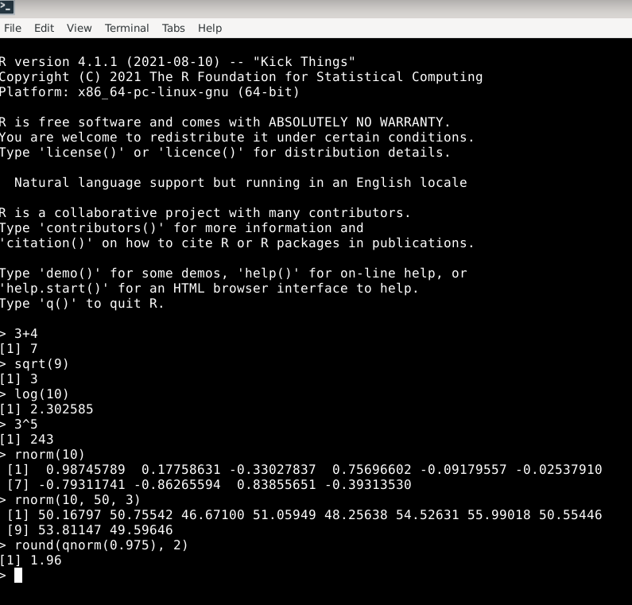
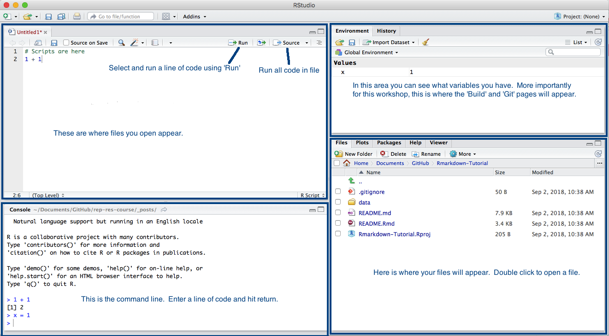

```{r setup, include=FALSE}
knitr::opts_chunk$set(echo=TRUE, eval=FALSE)
options(width=180, tibble.width=140)
```

## The R Project for Statistical Computing


<!--  -->

- https://www.r-project.org
- Software estadístico libre, abierto y gratuito
- Miles de librerías y proyectos complementan el software base en distintas plataformas:
+ https://cran.r-project.org/
+ https://r-forge.r-project.org/
+ https://www.bioconductor.org/
- Una gran comunidad de usuarios escribe en blogs y foros:
+ https://www.r-bloggers.com/
+ https://rweekly.org/
+ https://stackoverflow.com/questions/tagged/r
- Por qué R?
+ Porque podéis escribir las instrucciones en R scripts, y ejecutarlas todas de una vez, sin tener que memorizar y repetir cada uno de los pasos.
+ Porque en Internet podréis encontrar solución a (casi) todos los problemas que os encontréis
+ Porque podréis personalizar/modificar cada instrucción con las opciones deseadas.
+ Porque podéis trabajar con más de una base de datos abierta simultáneamente y no tienen que estar guardadas en un formato específico para poder abrirlas.


## R como calculadora

- R es esencialmente una consola en la que el cursor se sitúa tras el símbolo `>`. Ahí se escriben las instrucciones. Se ejecutan con `Enter`.
- Para empezar, R permite realizar las operaciones de cualquier calculadora científico.
- Incluye además instrucciones específicas para operaciones estadísticas.



```{r, echo=FALSE, eval=FALSE}
install.packages("tidyverse") # instala la librería tidyverse, que a su vez instala las librerías dplyr, tidyr, haven, y otras 
```


## Necesitamos un editor

- Más práctico: ejecutar múltiples operaciones simultáneamente.
- Para ello: se escriben todas en un fichero de texto simple, pero con extensión `.r` en lugar de `.txt`.
- Es suficiente un editor de texto simple. En Windows: **Bloc de notas** (en OS X: **TextEdit**).
- Otros editores facilitan la introducción y ejecución de las instrucciones.
- Ej.: **Notepad++**, **Sublime Text**, **Visual Studio Code**, **Geany**, **Nano**, **Emacs**, **VIM**, ...
- Enfocado al uso de **R** y el más usado para ello: **RStudio** (nombre del editor y de la empresa que lo produce y comercializa).
+ RStudio no es software libre, aunque su edición básica es de código abierto y gratuita.
+ https://www.rstudio.com/


## Algunas nociones sobre RStudio

- Las instrucciones en el R-script en RStudio se ejecutan con `Control+Enter`




## Qué nos encontraremos en R?

- Objetos elementales de las siquientes clases:
+ Lógicos (`TRUE` y `FALSE`)
+ Numéricos
+ Cadenas de caracteres
- Se pueden crear objetos más complejos añadiéndoles atributos, como pueden ser las dimensiones o las etiquetas, o modificando su estructura.
- A partir de los anteriores se pueden crear objetos compuestos con diferentes estructuras, como pueden ser: 
+ Vectores
* Todos los elementos del vector han de ser de la misma clase.
* Se crean y se unen con la función `c(...)`
* Se usa `vector[i]` para acceder al i-ésimo elemento del vector
* Una matriz es un vector con 2 dimensiones
+ Factores (para las variables categóricas; pueden ser o no ordenados)
+ Listas (colección ordenada de objetos no necesariamente del mismo tipo)
+ Data frames (para las bases de datos)
- R es un lenguaje orientado a objetos. Para asignar nombre a los objetos usamos el símbolo `<-`
- Funciones: evalúan objetos. La evaluación de un objeto `x` con una función `f` se codifica `f(x)`. Por ejemplo, para conocer la clase, estructura y atributos de un objeto `x` escribiríamos `class(x)`, `str(x)` y `attributes(x)` respectivamente.
- R dispone de una ayuda muy completa sobre todas las funciones, procedimientos y elementos que configuran el lenguaje
- Se puede acceder a ella con la función `help()` o mediante `?`. Por ejemplo, `help(class)` o `?attributes`.
- Se pueden escribir comentarios (secciones de código que el programa no ejecuta), situando antes un símbolo `#`
- Los missings en R se representan con el símbolo `NA` (cualquier clase de objetos) o también  `NaN` (objetos numéricos).

## Empecemos

```{r, echo=TRUE, eval=FALSE}
install.packages("tidyverse") # instala la librería tidyverse, que a su vez instala las librerías dplyr, tidyr, haven, y otras (https://www.tidyverse.org, https://github.com/tidyverse/tidyverse)
#getwd() # Cuál es el directorio de trabajo actual?
setwd("P:/projects/Curso-R") # En qué directorio de trabajo nos situamos ahora; se tienen que sustituir los \ por /
```

O bien, mediante RStudio:

+ Panel `Packages > Install`
+ `Session > Set Working Directory > Choose Directory`
+ `Session > Set Working Directory > To Source File Location`

Para abrir ficheros de excel disponemos de diversas funciones en las librerías `readxl` y `openxlsx` entre muchas otras. Aunque la segunda librería tiene más funciones para manipular y escribir ficheros `.xlsx`, la primera dispone de funciones que nos permiten leer también ficheros `.xls`
```{r eval=TRUE}
library(readxl)
#help(package = "readxl") # Informémonos acerca de la librería readxl
#?read_excel # ayuda de la función read_excel
read_excel("data_curs_stat/EP1.xls")

```


## Abrir bases de datos y ejecutar funciones: R no es como Stata.


La función `read_excel` abre la base de datos, pero a diferencia de instrucciones como `use` o `import excel` en Stata, no la copia a memoria. Así, si en Stata podríamos ejecutar `describe` o `summarize`, si en R ejecutamos una función como `summary` el resultado es la propia función.
```{r eval=TRUE}
summary
```

Tenemos que evaluar la función `summary` en la base de datos que abrimos con `read_excel`:
```{r eval=TRUE}
summary(read_excel("data_curs_stat/EP1.xls"))
```

## Primeros pasos con una base de datos 

No es práctico. Asignamos la base de datos a una variable que llamamos `dataw1`:
```{r eval=TRUE}
dataw1 <- read_excel("data_curs_stat/EP1.xls")
#summary(dataw1)
#str(dataw1)
class(dataw1)
head(dataw1) # primeras (6) filas
#head(dataw1, 3) # primeras 3 filas
#tail(dataw1) # últimas (6) filas
```

**Ejercicio:** 

*Usando las funciones `setwd` y `read_excel` convenientemente (hay varias posibilidades), guardar también las bases de datos `EP2.xls` y `EP3.xls` en dos variables que llamaremos `dataw2` y `dataw3`. Podéis ver `dataw1`, `dataw2`, `dataw3` y sus dimensiones en el panel `Environment` de RStudio?*

```{r echo=FALSE, eval=TRUE}
dataw2 <- read_excel("data_curs_stat/EP2.xls")
dataw3 <- read_excel("data_curs_stat/EP3.xls")

```

**Nota:** _Para abrir ficheros `*.csv` disponemos de la función `read.csv` en R y de la función `read_csv` de la librería `readr` entre otras. La librería `haven` dispone de diversas funciones que permiten abrir y escribir ficheros en formatos de Stata, SPSS y SAS (pueden consultarse en su ayuda, `package(help = "haven")`). Por otra parte la librería `readspss` (https://github.com/JanMarvin/readspss) tiene funciones que permiten abrir bases de datos en formato de SPSS encriptadas con contraseña._


## Acceso a las variables de una base de datos: `$` y `[[`

```{r eval=TRUE}
# dataw1$phys_hea1
# dataw1[["phys_hea1"]]
class(dataw1$phys_hea1) # chr quiere decir que está guardada como una cadena de carácteres
#summary(dataw1$phys_hea1)
str(dataw1$phys_hea1)
#attributes(dataw1$phys_hea1)
table(dataw1$phys_hea1)
#?table
table(dataw1$phys_hea1, useNA = "ifany")
prop.table(table(dataw1$phys_hea1))
```

## Guardando los resultados

Hemos dicho que R es como una calculadora, y que si no asignamos los objetos a variables, se muestran en consola pero no quedan guardados en ningún sitio.

- Los objetos de R (como una base de datos o dataframe) se pueden guardar con la función `save` en ficheros con la extensión `.rda` o `.rdata` (aunque a veces también se escribe la `r` e incluso la `d` en mayúscula, por ejemplo `.RData`)
- Los resultados, si son matrices, data frames o tablas, además, también se pueden guardar en ficheros `.csv` o con formatos de excel (a menudo, las funciones mencionadas de la forma `read_` o `read.` tienen correspondientes `write_` o `write.`).
- Los resultados y más generalmente todo aquello que aparece por consola puede ser guardados en ficheros de texto con la función `sink`.
- A no ser que se especifique la dirección del fichero, serán guardados en el directorio donde R está trabajando (`getwd()`)
```{r echo=TRUE, eval=TRUE}
#?sink
sink("Summary_Estudi_poblacional_w1.txt", split = TRUE)
table(dataw1$phys_hea1)
summary(dataw1$hea1)
sink()
```

**Ejercicio:**

*Qué aparece en el fichero Summary_Estudi_poblacional_w1.txt?*


## Transformación de variables (I)

- La función `as.factor` permite transformar a una variable categórica
```{r eval=TRUE}
class(as.factor(dataw1$phys_hea1))
table(as.factor(dataw1$phys_hea1), useNA = "ifany")
```

- En formatos de fichero distintos de `.xls` o `.csv`, como pueden ser los formatos de Stata o SPSS, las categorías de las variables categóricas pueden estar grabadas como etiquetas, mientras los valores son numéricos. En esos casos, para recuperar las etiquetas como categorías es más conveniente usar la función `as_factor` de la librería `haven`.


Guardamos la transformación en la base de datos. Para ello usaremos la función `mutate` de la librería `dplyr`, que permite realizar varias transformaciones separadas por comas
```{r eval=FALSE}
library(dplyr)
#?mutate

dataw1 <- mutate(dataw1, phys_hea1 = as.factor(phys_hea1))

# es lo mismo que:

dataw1 <- dataw1 %>% mutate(phys_hea1 = as.factor(phys_hea1))

# podemos escrbir el argumento a la derecha de %>% en las líneas inferiores

dataw1 <- dataw1 %>% #partimos de la base de datos dataw1 y entonces
  mutate(phys_hea1 = as.factor(phys_hea1)) # transformamos la variable y la guardamos con el mismo nombre

# finalmente la base de datos queda guardada con el mismo nombre mediante la asignación inicial (dataw1 <- ...)
```

+ El primer argumento o valor de la función `mutate` es la base de datos o data frame.
+ Los siguientes argumentos son las transformaciones `variable_output = transformación` separadas por comas.
+ Usando `%>%`, la función situada en el lado derecho (en este caso `mutate`) ya reconoce que su primer argumento es el valor situado en el lado izquierdo de `%>%` (en este caso `dataw1`)

## Pipe

<div style="position: relative; top: 100px;">


</div>
## Transformación de variables (II)


Como la variable `q0002_hhid` es un id podría interesarnos que fuera de clase cadena
```{r}
#class(dataw1$q0002_hhid)
#?as.character
```


Varias transformaciones seguidas las podemos evaluar:
- Aplicando varias veces `mutate`:
```{r eval=FALSE}

dataw1 <- dataw1 %>% #partimos de la base de datos dataw1 y entonces
  mutate(phys_hea1 = as.factor(phys_hea1))  %>% # transformamos la variable phys_hea1 y la guardamos con el mismo nombre, y entonces
  mutate(dep1 = as.factor(dep1)) %>% # transformamos la variable dep1 y la guardamos con el mismo nombre
  mutate(q0002_hhid = as.character(q0002_hhid)) # transformamos la variable q0002_hhid y la guardamos con el mismo nombre

```

- Pero en lugar de eso, habitualmente se separan las instrucciones por comas en un sólo `mutate`:
```{r eval=FALSE}

dataw1 <- dataw1 %>% #partimos de la base de datos dataw1 y entonces
  mutate(phys_hea1 = as.factor(phys_hea1), dep1 = as.factor(dep1), q0002_hhid = as.character(q0002_hhid)) # transformamos las variables phys_hea1,  dep1 y q0002_hhid y las guardamos con los mismos nombres

```


**Ejercicio:** 

*Buscar todas las variables categóricas en las 3 bases de datos y transformar estas bases de datos de manera que esas variables sean factores. Mostrar las frecuencias de las categorías de algunas de esas variables. Transformar la variable `q0002_hhid` a cadena de carácteres. Consultar también la ayuda de `as.numeric`, `as.integer` y `as.factor`*

```{r echo=FALSE, eval=TRUE, include=FALSE}
library(dplyr)
dataw1 <- dataw1 %>%
  mutate(across(c(sex, age, mar_1, edu1, phys_hea1, dep1, income_inf1), as.factor), q0002_hhid = as.character(q0002_hhid))

dataw2 <- dataw2 %>%
  mutate(across(c(phys_hea2, dep2), as.factor), q0002_hhid = as.character(q0002_hhid))

dataw3 <- dataw3 %>%
  mutate(across(c(dep3, phys_hea3), as.factor), q0002_hhid = as.character(q0002_hhid))

```


## Otras operaciones con funciones de la librería `dplyr` y funciones de R para el cálculo de estadísticos

- Ejemplo 1

```{r eval=TRUE}

dataw1 %>% #partimos de la base de datos dataw1 y entonces
  select(q0002_hhid, hea1, dep1) %>% # mantenemos sólo las columnas q0002_hhid, hea1 y dep1, y entonces
  filter(dep1 == "Yes") %>% # nos quedamos con las filas de quienes padecen depresión, y entonces
  arrange(desc(hea1)) %>% # ordenamos las filas por de mayor a menor valor de estado de salud, y entonces
  head(3) # nos quedamos con los 3 pacientes con depresión con mayor valor de Health state

```

- Ejemplo 2 (uso de funciones de R como `mean`, `median` o `quantile`; se pueden usar otras como `var`, `sd`, `min`, `max`, `IQR`, etc.)

```{r eval=TRUE}

dataw1 %>% #partimos de la base de datos dataw1 y entonces
  select(q0002_hhid, hea1, dep1) %>% # mantenemos sólo las columnas number_id, hea1 y dep1, y entonces
  group_by(dep1) %>% # agrupamos por las categorías de depresión, y entonces
  summarise(mean_hea1 = mean(hea1, na.rm = TRUE), median_hea1 = median(hea1, na.rm = TRUE), tercil_hea1 = quantile(hea1, probs = 1/3, na.rm = TRUE), n = n()) # calculamos la media, la mediana y el primer tercil de hea1 para cada categoría de depresión y el número de observaciones por cada categoría

```

**Nota:** *usamos `na.rm = TRUE` dentro de `mean`, de `median` y de `quantile` para que calcule la media de aquellos valores que no son missing. En caso contrario, cuando hay missings el resultado es `NA`.*

**Nota:** *Todo lo anterior se puede realizar también con funciones de R sin necesidad de acudir a la librería `dplyr`, pero las alternativas pueden ser más complejas.*


```{r echo=FALSE, eval=FALSE}
dataw1 |> # partimos de la base de datos dataw1 y entonces
  subset(select = c(hea1, dep1)) |> # mantenemos sólo las columnas hea1 y dep1, y entonces
  transform(dep1 = as.factor(dep1)) |>  # transformamos la variable  dep1 y la guardamos con el mismo nombre, y entonces
  stats:::aggregate.formula(formula = hea1 ~ dep1, FUN = "mean") # calculamos la media de hea1 para cada categoría de depresión
```

## Cálculo de prevalencias:

Prevalencia de depresión:
```{r echo=TRUE, eval=TRUE}
dataw1 %>% 
  count(dep1) %>% # Contamos los individuos en cada categoría de depresión y entonces
  mutate(prop = 100*n/sum(n)) # calculamos el %

```

Prevalencia de depresión por grupos de edad y sin tener en cuenta los missings:
```{r echo=TRUE, eval=TRUE}
# ?is.na
dataw1 %>% 
  group_by(age) %>% 
  count(dep1) %>% # Contamos los individuos en cada categoría de depresión por grupo de edad y entonces
  filter(!is.na(dep1)) %>% # eliminamos los missings si nos interesa contar el porcentaje sobre el total de respuestas válidas
  mutate(prop = 100*n/sum(n)) # Calculamos el %

```

## Variables y dimensiones de las bbdd

```{r eval=TRUE}
names(dataw1)
dim(dataw1)
ncol(dataw1)
nrow(dataw1)
names(dataw2)
dim(dataw2)
names(dataw3)
dim(dataw3)
```


## Fusión (merge) de bbdd

Cuántos missings tiene la variable `q0002_hhid`?

```{r eval=TRUE}

table(is.na(dataw1$q0002_hhid)); table(is.na(dataw2$q0002_hhid)); table(is.na(dataw3$q0002_hhid))
```


Ya tenemos las bbdd abiertas y guardadas. Sólo tenemos que unir por la(s) variable(s) identificadora(s), en este caso `q0002_hhid`.
```{r eval=TRUE}
data <- dataw1 %>% # partimos de la base de datos dataw1 y entonces
  full_join(dataw2, by = "q0002_hhid") %>% # unimos horizontalmente con todas las observaciones de dataw2 con q0002_hhid iguales a los de dataw1 y añadimos las nuevas, y entonces
  full_join(dataw3, by = c("q0002_hhid"))# unimos horizontalmente con todas las observaciones de dataw3 con q0002_hhid iguales a los que ya había y añadimos las nuevas
names(data)
dim(data)
```

```{r}
?full_join
```

**Ejercicio:**

*Con `full_join` creamos una base de datos resultado de fusionar las 3 iniciales e incluír todas las observaciones de cada una de ellas. Consultando en la ayuda, este ejercicio consiste en fusionar las 3 bases de datos, pero incluyendo sólo aquellas observaciones de comunes a las 3. Cuántas observaciones tiene?*


## Combinar bases de datos

Abrimos las 3 olas de un ensayo clínico en fichero separados.
```{r eval=TRUE}
ac1 <- read_excel("data_curs_stat/AC1.xls")
ac2 <- read_excel("data_curs_stat/AC2.xls")
ac3 <- read_excel("data_curs_stat/AC3.xls")

dim(ac1); names(ac1); dim(ac2); names(ac2); dim(ac3); names(ac3)
```

Para poder combinarlas verticalmente, los nombres de las columnas que queremos combinar tienen que ser iguales. Para ello usamos otra función de la librería `dplyr`: `rename`
```{r eval=TRUE}
acr1 <- ac1 %>% # partimos de ac1 y entonces
  rename(hea = hea1) # renombramos hea1 como hea
acr2 <- ac2 %>% # partimos de ac2 y entonces
  rename(hea = hea2, dep = dep2) # renombramos hea2 como hea y dep2 como dea
acr3 <- ac3 %>% 
  rename(hea = hea3, dep = dep3) # mismo proceso para ac3

#names(ac1); names(ac2); names(ac3)
```

Finalmente combinamos las filas con otra función de la librería `dplyr`: `bind_rows`

```{r eval=TRUE}
#?bind_rows
acv <- bind_rows(acr1, acr2, acr3, .id = "wave")
```

## Otras opciones para combinar bases de datos

**Ejercicio:**

*Ver qué variables tiene `acv`; para qué se añadió `.id = "wave"`?; ejecutar `rbind(ac1,ac2,ac3)`*


**Nota:** _La función `rbind` de R hace esencialmente lo mismo, pero necesita que las 3 bases de datos tengan exactamente las mismas columnas. En caso en que esto no ocurre, como el presente, da un error. Además, tanto en el caso de `rbind` como de `bind_rows`, conviene que las columnas por las que se combina (las de igual nombre) tengan la misma clase, pues en caso contrario pueden ocurrir errores o comportamiento extraños._


**Nota:** *Las funciones `cbind` y `bind_cols` de R y `dplyr` respectivamente combinan por columnas. Se diferencian de un merge en que no hay una columna "común" por la que fusionar, sino que se añaden las columnas de los distintos objetos, tal como están ordenadas en cada uno de ellos. Además, todas las columnas tienen que tener el mismo número de elementos.*


Fusionamos horizontalmente las 3 bbdd originales de los ensayos clínicos. En este caso no las podemos combinar porque tienen distinto número de filas:
```{r eval=TRUE}
ach <- ac1 %>%
  full_join(ac2, by = c("q0002_hhid")) %>%
  full_join(ac3, by = c("q0002_hhid"))
ach %>% 
  head()
# cbind(ac1, ac2, ac3) %>% 
#    head()
```


## Rellenando datos

Cuando se combinan las filas mediante `bind_cols`, las columnas que sólo están en una base de datos se llenan con missings. Por ejemplo, es el caso de las variables sociodemográficas, que en el dataframe `acv` sólo tienen datos en las filas correspondientes a la ola 1, que son las filas obtenidas de `ac1`. 

```{r eval=TRUE}
acv %>%
  arrange(q0002_hhid) %>% # ordenamos por id
  head()
```


Acudimos ahora a la función `fill` de la librería `tidyr`:
```{r eval=TRUE}
library(tidyr)
acv %>%
  group_by(q0002_hhid) %>% # agrupamos por id y entonces
  arrange(wave) %>% # ordenamos por ola para tener la fila con datos antes que las otras, y entonces
  fill(sex, age, mar_1, edu1, grups) %>% # para cada id rellenamos las filas vacías de las variables especificadas con los valores que no son missings, y entonces
  ungroup() %>% # desagrupamos y entonces
  arrange(q0002_hhid) %>% # ordenamos por id para ver las mismas filas que arriba, y entonces
  head() # nos quedamos con las primeras filas
```


## Pivotar (vertical/largo --> horizontal/ancho)

Pivotar es el proceso de transformar una base de datos vertical/longitudinal (por ejemplo el resultado de combinar filas, como es el caso de `acv`) a una horizontal (por ejemplo el producto de un una fusión, como es el caso de `ach`)  o a la inversa.

**Ejercicio:**

* *Modificar `acv` de tal manera que sus variables sociodemográficas estén completas tal como se indicó en la diapositiva anterior.*
* *Qué variables tiene acv?*
* *Qué variables de avc no tienen necesariamente los mismos valores en las distintas olas?*

```{r echo=FALSE, eval=TRUE}
acv <- acv %>%
  group_by(q0002_hhid) %>% # agrupamos por id y entonces
  arrange(wave) %>% # ordenamos por ola para tener la fila con datos antes que las otras, y entonces
  fill(sex, age, mar_1, edu1, grups) # para cada id rellenamos las filas vacías de las variables especificadas con los valores que no son missings
```

Pivotaje usando la función `pivot_wider` de la librería `tidyr`:


```{r eval=TRUE}
#?pivot_wider
acv %>%
  pivot_wider(names_from = c("wave"), values_from = c("hea", "dep")) %>%
  # select(-where(~all(is.na(.)))) %>% # quitamos aquellas columnas que cumplen que todos sus valores son missings
  head()

```

Para el pivotaje inverso se utilizaría la función `pivot_longer`.
```{r}
#?pivot_longer
```


## T-test

Comparamos entre grupos mediante un t-test:
```{r, eval=TRUE}
t.test(hea1 ~ sex, data = dataw1)
t.test(data$hea1, data$hea2, paired = TRUE) #comparamos el estado de salud en la ola 1 con la ola 2
```

## Chi-cuadrado y correlación

-Test de chi-cuadrado
```{r, eval=TRUE}
chisq.test(dataw1$dep1, dataw1$sex)
```

-Cálculo de correlaciones
```{r eval=TRUE}
#cor(dataw1$score_sup, dataw1$income)
cor.test(dataw1$score_sup1, dataw1$income1)
```

**Ejercicio:**

*Consultar la ayuda de `cor`. Calcular la correlación de Spearman. Cómo tendríamos que hacer si hay valores missing?*


## Regresión lineal:


```{r echo=FALSE, eval=TRUE}
dataw1 <- dataw1 %>% 
  mutate(across(c(sex, age, mar_1, edu1, phys_hea1, dep1, income_inf1), as.factor))
```


```{r eval=TRUE}
#?lm
fit <- lm(hea1 ~ age + sex + income1 + dep1, data = dataw1)
summary(fit)
```

## Regresión logística


```{r eval=TRUE}
#?glm
fit <- glm(dep1 ~ age + sex + income1*hea1 + mar_1*score_lon1, data = dataw1, family = binomial)
summary(fit)
```

## Intervalos de confianza

Con la función `t.test` podemos obtener el intervalo de confianza de una colección de valores
```{r, eval=TRUE}
t.test(dataw1$hea1)$conf.int
```

Intervalos de confianza de los coeficientes de un modelo:
```{r echo=TRUE, eval=TRUE}
#?confint
confint(fit)

```


## Gràficas de modelos lineales simples usando `ggplot`: una única variable predictora

```{r echo=TRUE, eval=TRUE, fig.height=5}

library(ggplot2)
fit <- lm(hea1 ~ income1, data = dataw1)
dataw1 %>%
  filter(!is.na(hea1), !is.na(income1)) %>% # nos quedamos con las observaciones que no tienen missings en el modelo
  # filter(!if_any(c(hea1, income1), is.na)) %>% # lo mismo de forma resumida
  cbind(predict(fit, interval = "confidence")) %>% # añadimos la predicción del modelo y los intervalos de confianza como nuevas columnas
  ggplot(aes(x = income1)) + # creamos el cuadro y añadimos el eje x
  geom_point(aes(y = hea1)) + # añadimos los punos d la base de datos
  geom_line(aes(y = fit)) + # añadimos la línea que el modelo induce
  geom_ribbon(aes(ymin = lwr, ymax = upr), alpha = .15) + # añadimos los CI; también es posible como sigue
  # geom_line(aes(y = lwr), color = "red", linetype = "dashed") +
  # geom_line(aes(y = upr), color = "red", linetype = "dashed") +
  theme_bw() # cambiamos el tema por defecto


```

## Gràficas de modelos lineales usando `ggplot`: una variable predictora continua y otra categórica

```{r echo=TRUE, eval=TRUE, fig.height=5}

library(ggplot2)
fit <- lm(hea1 ~ income1 + edu1, data = dataw1)
dataw1 %>%
  # filter(!is.na(hea1), !is.na(income1), !is.na(edu1)) %>% # nos quedamos con las observaciones que no tienen missings en el modelo
  filter(!if_any(c(hea1, income1, edu1), is.na)) %>% # lo mismo de forma resumida
  cbind(predict(fit, interval = "confidence")) %>% # añadimos la predicción del modelo y los intervalos de confianza como nuevas columnas
  ggplot(aes(x = income1, color = edu1)) + # creamos el cuadro y añadimos el eje x
  geom_point(aes(y = hea1)) + # añadimos los punos d la base de datos
  geom_line(aes(y = fit)) + # añadimos la línea que el modelo induce
  geom_ribbon(aes(ymin = lwr, ymax = upr, color = NULL, fill = edu1), alpha = .15) # añadimos los CI
  

```


## Gràficas de modelos lineales generalizados simples usando `ggplot`: una única variable predictora

```{r echo=TRUE, eval=TRUE, fig.height=5}

library(ggplot2)
fit <- glm(dep1 ~ income1, data = dataw1, family = binomial)
dataw1 %>%
  filter(!if_any(c(dep1, income1), is.na)) %>%  # nos quedamos con las observaciones que no tienen missings en el modelo
  mutate(fit = predict(fit, type = "response")) %>% # añadimos la predicción del modelo como nuevas columnas
  ggplot(aes(x = income1)) + # creamos el cuadro y añadimos el eje x
  geom_line(aes(y = fit)) + # añadimos la línea que el modelo induce
  labs(y = "Predicted probability of dep1 == Yes") + # especificamos la etiqueta del eje y
  theme_classic() #cambiamos el tema por defecto


```


```{r echo=FALSE, eval=FALSE, fig.height=5}

library(ggplot2)
fit <- glm(dep1 ~ income1, data = dataw1, family = binomial)
dataw1 %>%
  filter(!if_any(c(dep1, income1), is.na)) %>%  # nos quedamos con las observaciones que no tienen missings en el modelo
  mutate(fit = predict(fit, type = "response")) %>% # añadimos la predicción del modelo como nuevas columnas
  # cbind(predict(fit, type = "link", se.fit = TRUE)) %>% # añadimos la predicción del modelo como nuevas columnas
  # mutate(lwr = fit - 1.96 * se.fit, upr = fit + 1.96 * se.fit) %>%
  # mutate(across(c(fit, lwr, upr), ~1/(1+exp(-.)))) %>%
  ggplot(aes(x = income1)) + # creamos el cuadro y añadimos el eje x
  geom_line(aes(y = fit)) + # añadimos la línea que el modelo induce
  # geom_ribbon(aes(ymin = lwr, ymax = upr), alpha = .15) + # añadimos los CI
  labs(y = "Predicted probability of dep1 == Yes") + # especificamos la etiqueta del eje y
  theme_classic() #cambiamos el tema por defecto


```


## Gràficas de modelos lineales generalizados usando `ggplot`: una variable predictora continua y otra categórica

```{r echo=TRUE, eval=TRUE, fig.height=5}

library(ggplot2)
fit <- glm(dep1 ~ income1 + edu1, data = dataw1, family = binomial)
dataw1 %>%
  filter(!if_any(c(dep1, income1, edu1), is.na)) %>%  # nos quedamos con las observaciones que no tienen missings en el modelo
  mutate(fit = predict(fit, type = "response")) %>% # añadimos la predicción del modelo como nuevas columnas
  ggplot(aes(x = income1, color = edu1)) + # creamos el cuadro y añadimos el eje x
  geom_line(aes(y = fit)) + # añadimos la línea que el modelo induce
  labs(y = "Predicted probability of dep1 == Yes") + # especificamos la etiqueta del eje y
  theme_minimal() # cambiamos el tema por defecto


```

```{r echo=FALSE, eval=FALSE}

library(ggplot2)
fit <- glm(dep1 ~ income1 * edu1, data = dataw1, family = binomial)
dataw1 %>%
  filter(!if_any(c(dep1, income1, edu1), is.na)) %>%  # nos quedamos con las observaciones que no tienen missings en el modelo
  # mutate(fit = predict(fit, type = "response")) %>% # añadimos la predicción del modelo como nuevas columnas
  cbind(predict(fit, type = "link", se.fit = TRUE)) %>% # añadimos la predicción del modelo como nuevas columnas
  mutate(lwr = fit - 1.96 * se.fit, upr = fit + 1.96 * se.fit) %>%
  mutate(across(c(fit, lwr, upr), ~1/(1+exp(-.)))) %>%
  ggplot(aes(x = income1, color = edu1)) + # creamos el cuadro y añadimos el eje x
  geom_line(aes(y = fit)) + # añadimos la línea que el modelo induce
  geom_ribbon(aes(ymin = lwr, ymax = upr, fill = edu1), alpha = .15) + # añadimos los CI
  labs(y = "Predicted probability of dep1 == Yes") +  # especificamos la etiqueta del eje y
  theme_bw() # cambiamos el tema por defecto


```

## Otras formas de obtener resultados estadísticos en R

De la misma manera que `tidyverse` hace referencia a una colección de librerías que simplifican la manipulación de datframes, existe otra colección de librerías, `easystats` (https://easystats.github.io/easystats/), cuyo objetivo es mostrar los resultados de tests y modelos estadísticos con mejor formato.

**Ejercicio 8**:

*Instalar y cargar las librerías `performance` y `parameters` y probar las funciones `model_performance` y `model_parameters` aplicadas a `fit`*.

La librería `modelsummary` dispone de 2 <u>funciones</u> que permiten visualizar multiples resultados en tablas bien organizadas: 

+ `modelsummary` (https://vincentarelbundock.github.io/modelsummary/articles/modelsummary.html) y 
+ `datasummary` (https://vincentarelbundock.github.io/modelsummary/articles/datasummary.html). 

Otras <u>librerías</u> que permiten visualizar descriptivos y resultados resumidos en tablas son:

+ `summarytools` (https://cran.r-project.org/web/packages/summarytools/vignettes/introduction.html) y 
+ `compareGroups` (https://cran.r-project.org/web/packages/compareGroups/vignettes/compareGroups_vignette.html).

Existen distintas <u>librerías</u> que facilitan la representación gráfica de modelos, predicciones, ...:

+ `jtools` (https://cran.r-project.org/web/packages/jtools/vignettes/effect_plot.html)
+ `effects` (https://cran.r-project.org/web/packages/effects/vignettes/predictor-effects-gallery.pdf)
+ `ggeffects`(https://strengejacke.github.io/ggeffects/)

## 

