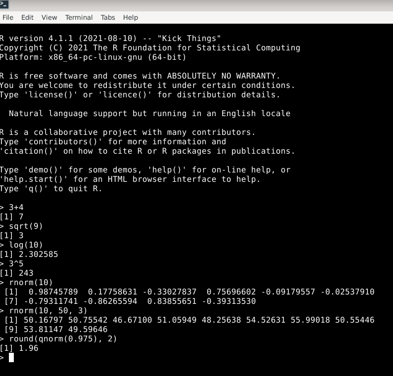
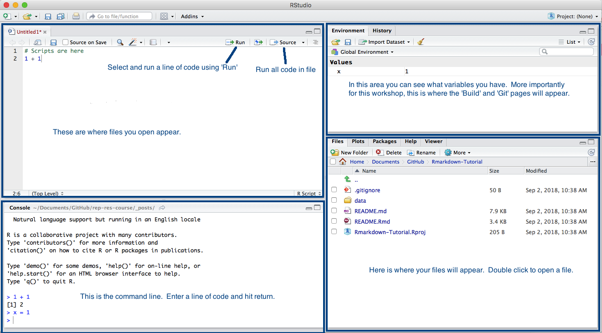

Introducción a R
========================================================
author: Iago Giné Vázquez
date: 2021-09-13
autosize: true
width: 2560
height: 1440
css: RCP.css


The R Project for Statistical Computing
========================================================


<!--  -->

- https://www.r-project.org
- Software estadístico libre, abierto y gratuito
- Miles de librerías y proyectos complementan el software base en distintas plataformas:
  + https://cran.r-project.org/
  + https://r-forge.r-project.org/
  + https://www.bioconductor.org/
- Una gran comunidad de usuarios escribe en blogs y foros:
  + https://www.r-bloggers.com/
  + https://rweekly.org/
  + https://stackoverflow.com/questions/tagged/r
- Por qué R?
  + Porque podéis escribir las instrucciones en R scripts, y ejecutarlas todas de una vez, sin tener que memorizar y repetir cada uno de los pasos.
  + Porque en Internet podréis encontrar solución a (casi) todos los problemas que os encontréis
  + Porque podréis personalizar/modificar cada instrucción con las opciones deseadas.
  + Porque podéis trabajar con más de una base de datos abierta simultáneamente y no tienen que estar guardadas en un formato específico para poder abrirlas.


R como calculadora
========================================================
- R es esencialmente una consola en la que el cursor se sitúa tras el símbolo `>`. Ahí se escriben las instrucciones. Se ejecutan con `Enter`.
- Para empezar, R permite realizar las operaciones de cualquier calculadora científico.
- Incluye además instrucciones específicas para operaciones estadísticas.




Necesitamos un editor
========================================================
- Más práctico: ejecutar múltiples operaciones simultáneamente.
- Para ello: se escriben todas en un fichero de texto simple, pero con extensión `.r` en lugar de `.txt`.
- Es suficiente un editor de texto simple. En Windows: **Bloc de notas** (en OS X: **TextEdit**).
- Otros editores facilitan la introducción y ejecución de las instrucciones.
- Ej.: **Notepad++**, **Sublime Text**, **Visual Studio Code**, **Geany**, **Nano**, **Emacs**, **VIM**, ...
- Enfocado al uso de **R** y el más usado para ello: **RStudio** (nombre del editor y de la empresa que lo produce y comercializa).
  + RStudio no es software libre, aunque su edición básica es de código abierto y gratuita.
  + https://www.rstudio.com/
  


Algunas nociones sobre RStudio
========================================================
- Las instrucciones en el R-script en RStudio se ejecutan con `Control+Enter`



Qué nos encontraremos en R?
========================================================
- Objetos elementales de las siquientes clases:
    + Lógicos (`TRUE` y `FALSE`)
    + Numéricos
    + Cadenas de caracteres
- Se pueden crear objetos más complejos añadiéndoles atributos, como pueden ser las dimensiones o las etiquetas, o modificando su estructura.
- A partir de los anteriores se pueden crear objetos compuestos con diferentes estructuras, como pueden ser: 
    + Vectores
      * Todos los elementos del vector han de ser de la misma clase.
      * Se crean y se unen con la función `c(...)`
      * Se usa `vector[i]` para acceder al i-ésimo elemento del vector
      * Una matriz es un vector con 2 dimensiones
    + Factores (para las variables categóricas; pueden ser o no ordenados)
    + Listas (colección ordenada de objetos no necesariamente del mismo tipo)
    + Data frames (para las bases de datos)
- R es un lenguaje orientado a objetos. Para asignar nombre a los objetos usamos el símbolo `<-`
- Funciones: evalúan objetos. La evaluación de un objeto `x` con una función `f` se codifica `f(x)`. Por ejemplo, para conocer la clase, estructura y atributos de un objeto `x` escribiríamos `class(x)`, `str(x)` y `attributes(x)` respectivamente.
- R dispone de una ayuda muy completa sobre todas las funciones, procedimientos y elementos que configuran el lenguaje
- Se puede acceder a ella con la función `help()` o mediante `?`. Por ejemplo, `help(class)` o `?attributes`.
- Se pueden escribir comentarios (secciones de código que el programa no ejecuta), situando antes un símbolo `#`
- Los missings en R se representan con el símbolo `NA` (cualquier clase de objetos) o también  `NaN` (objetos numéricos).


Empecemos
========================================================

```r
install.packages("tidyverse") # instala la librería tidyverse, que a su vez instala las librerías dplyr, tidyr, haven, y otras (https://www.tidyverse.org, https://github.com/tidyverse/tidyverse)
#getwd() # Cuál es el directorio de trabajo actual?
setwd("~/Documents/PSSJD/Curso-R/") # En qué directorio de trabajo nos situamos ahora
```

O bien, mediante RStudio:
+ Panel `Packages > Install`
+ `Session > Set Working Directory > Choose Directory`
+ `Session > Set Working Directory > To Source File Location`

Cómo abriríamos la base de datos en Stata? El comando `use` la copia a la memoria

```stata
. use “data_curs_stat\Estudi_pob_w1.dta”, clear
```
Y en R? Usaremos la librería `haven`.

```r
library(haven)
#help(package = "haven") # Informémonos acerca de la librería haven
#?read_dta # ayuda de la función read_dta
read_dta("data_curs_stat/Estudi_pob_w1.dta")
```

```
# A tibble: 4,753 x 14
   q0002_hhid number_id ID_ECS       sex       age      mar1          edu1  phys_hea1  hea1   dep1 score_lon1 score_sup1 income1 income_inf1
        <dbl> <chr>      <dbl> <dbl+lbl> <dbl+lbl> <dbl+lbl>     <dbl+lbl>  <dbl+lbl> <dbl> <dbl+>      <dbl>      <dbl>   <dbl>   <dbl+lbl>
 1          1 724000001      1  2 [fem]  2 [35-49]   1 [Yes] 4 [Tertiary]  1 [None]    70.5 0 [No]          3         12      15  2 [Normal]
 2          2 724000002      2  1 [masc] 2 [35-49]   1 [Yes] 4 [Tertiary]  1 [None]    78.9 0 [No]          3         12      17  2 [Normal]
 3          3 724000003      3  1 [masc] 4 [65-79]   1 [Yes] 2 [Primary]   1 [None]    66.6 0 [No]          3         12      15  2 [Normal]
 4          4 724000004      4  1 [masc] 3 [50-64]   1 [Yes] 2 [Primary]   2 [1 phys~  77.4 0 [No]          3         11      18  2 [Normal]
 5          5 724000005      5  2 [fem]  3 [50-64]   0 [No]  4 [Tertiary]  1 [None]    52.5 0 [No]          3         12      29  2 [Normal]
 6          6 724000006      6  2 [fem]  3 [50-64]   0 [No]  4 [Tertiary]  1 [None]    53.7 0 [No]          3         13      25  2 [Normal]
 7          7 724000007      7  1 [masc] 3 [50-64]   1 [Yes] 3 [Secondary] 1 [None]    59.1 0 [No]          6         10      12  3 [Good]  
 8          8 724000008      8  1 [masc] 3 [50-64]   1 [Yes] 2 [Primary]   1 [None]    76.4 0 [No]          3         12      14  2 [Normal]
 9          9 724000009      9  2 [fem]  3 [50-64]   0 [No]  3 [Secondary] 1 [None]    73.7 0 [No]          3         11      26  3 [Good]  
10         10 724000010     10  2 [fem]  5 [80+]     0 [No]  2 [Primary]   3 [2+ phy~  28.0 0 [No]          6         13      10  2 [Normal]
# ... with 4,743 more rows
```

Primeros pasos con una base de datos (I)
========================================================
La función `read_dta` abre la base de datos, pero a diferencia de la instrucción `use` en Stata, no la copia a memoria. Así, si en Stata el podríamos ejecutar `describe` o `summarize`, si en R ejecutamos una función como `summary` el resultado es la propia función.

```r
summary
```

```
function (object, ...) 
UseMethod("summary")
<bytecode: 0x0000000023f57558>
<environment: namespace:base>
```

Tenemos que evaluar la función `summary` en la base de datos que abrimos con `read_dta`:

```r
summary(read_dta("data_curs_stat/Estudi_pob_w1.dta"))
```

```
   q0002_hhid     number_id             ID_ECS           sex             age             mar1             edu1         phys_hea1          hea1            dep1       
 Min.   :    1   Length:4753        Min.   :    1   Min.   :1.000   Min.   :1.000   Min.   :0.0000   Min.   :1.000   Min.   :1.000   Min.   : 0.00   Min.   :0.0000  
 1st Qu.: 1327   Class :character   1st Qu.: 1327   1st Qu.:1.000   1st Qu.:3.000   1st Qu.:0.0000   1st Qu.:1.000   1st Qu.:1.000   1st Qu.:42.83   1st Qu.:0.0000  
 Median : 2615   Mode  :character   Median : 2615   Median :2.000   Median :3.000   Median :1.0000   Median :2.000   Median :2.000   Median :55.64   Median :0.0000  
 Mean   : 3145                      Mean   : 3145   Mean   :1.547   Mean   :3.235   Mean   :0.5986   Mean   :2.258   Mean   :1.798   Mean   :53.97   Mean   :0.1113  
 3rd Qu.: 3807                      3rd Qu.: 3807   3rd Qu.:2.000   3rd Qu.:4.000   3rd Qu.:1.0000   3rd Qu.:3.000   3rd Qu.:2.000   3rd Qu.:66.06   3rd Qu.:0.0000  
 Max.   :92755                      Max.   :92755   Max.   :2.000   Max.   :5.000   Max.   :1.0000   Max.   :4.000   Max.   :3.000   Max.   :92.82   Max.   :1.0000  
                                                                                                     NA's   :5       NA's   :605     NA's   :187     NA's   :170     
   score_lon1     score_sup1       income1        income_inf1   
 Min.   :3.00   Min.   : 3.00   Min.   : 1.000   Min.   :1.000  
 1st Qu.:3.00   1st Qu.:10.00   1st Qu.: 2.000   1st Qu.:1.000  
 Median :3.00   Median :12.00   Median : 5.000   Median :2.000  
 Mean   :3.74   Mean   :11.53   Mean   : 8.989   Mean   :1.991  
 3rd Qu.:4.00   3rd Qu.:13.00   3rd Qu.:15.000   3rd Qu.:3.000  
 Max.   :9.00   Max.   :14.00   Max.   :35.000   Max.   :3.000  
 NA's   :285    NA's   :414     NA's   :1067     NA's   :185    
```

Primeros pasos con una base de datos (II)
========================================================
No es práctico. Asignamos la base de datos a una variable que llamamos `dataw1`:

```r
dataw1 <- read_dta("data_curs_stat/Estudi_pob_w1.dta")
#summary(dataw1)
#str(dataw1)
class(dataw1)
```

```
[1] "tbl_df"     "tbl"        "data.frame"
```

```r
head(dataw1) # primeras (6) filas
```

```
# A tibble: 6 x 14
  q0002_hhid number_id ID_ECS       sex       age      mar1         edu1    phys_hea1  hea1   dep1 score_lon1 score_sup1 income1 income_inf1
       <dbl> <chr>      <dbl> <dbl+lbl> <dbl+lbl> <dbl+lbl>    <dbl+lbl>    <dbl+lbl> <dbl> <dbl+>      <dbl>      <dbl>   <dbl>   <dbl+lbl>
1          1 724000001      1  2 [fem]  2 [35-49]   1 [Yes] 4 [Tertiary] 1 [None]      70.5 0 [No]          3         12      15  2 [Normal]
2          2 724000002      2  1 [masc] 2 [35-49]   1 [Yes] 4 [Tertiary] 1 [None]      78.9 0 [No]          3         12      17  2 [Normal]
3          3 724000003      3  1 [masc] 4 [65-79]   1 [Yes] 2 [Primary]  1 [None]      66.6 0 [No]          3         12      15  2 [Normal]
4          4 724000004      4  1 [masc] 3 [50-64]   1 [Yes] 2 [Primary]  2 [1 physic~  77.4 0 [No]          3         11      18  2 [Normal]
5          5 724000005      5  2 [fem]  3 [50-64]   0 [No]  4 [Tertiary] 1 [None]      52.5 0 [No]          3         12      29  2 [Normal]
6          6 724000006      6  2 [fem]  3 [50-64]   0 [No]  4 [Tertiary] 1 [None]      53.7 0 [No]          3         13      25  2 [Normal]
```

```r
#head(dataw1, 3) # primeras 3 filas
#tail(dataw1) # últimas (6) filas
```

**Ejercicio 1**: 

*Usando las funciones `setwd` y `read_dta` convenientemente (hay varias posibilidades), guardar también las bases de datos `Estudi_pob_w2.dta` y `Estudi_pob_w3.dta` en dos variables que llamaremos `dataw2` y `dataw3`. Podéis ver `dataw1`, `dataw2`, `dataw3` y sus dimensiones en el panel `Environment` de RStudio?*


**Nota:** _Para abrir ficheros `*.csv` disponemos de la función `read.csv` en R y de la función `read_csv` de la librería `readr` entre otras. Para abrir ficheros de excel disponemos de diversas funciones en las librerías `readxl` y `openxlsx` entre muchas otras. Por otra parte la librería `readspss` (https://github.com/JanMarvin/readspss) tiene funciones que permiten abrir bases de datos en formato de SPSS encriptadas con contraseña._


Acceso a las variables de una base de datos: `$` y `[[`
========================================================

```r
# dataw1$phys_hea1
# dataw1[["phys_hea1"]]
class(dataw1$phys_hea1) # double quiere decir que está guardada como una variable numérica
```

```
[1] "haven_labelled" "vctrs_vctr"     "double"        
```

```r
#summary(dataw1$phys_hea1)
str(dataw1$phys_hea1)
```

```
 dbl+lbl [1:4753]  1,  1,  1,  2,  1,  1,  1,  1,  1,  3,  1,  1,  3,  1, NA, NA,  3,  1,  2,  2,  1,  2,  2,  1,  1, NA,  2,  1,  1,  1,  1,  3,  1,  1,  1,  3,  1,  1,  1,  ...
 @ label       : chr "Number of physical health problems W1"
 @ format.stata: chr "%27.0g"
 @ labels      : Named num [1:3] 1 2 3
  ..- attr(*, "names")= chr [1:3] "None" "1 physical health problem" "2+ physical health problems"
```

```r
#attributes(dataw1$phys_hea1)
table(dataw1$phys_hea1)
```

```

   1    2    3 
1723 1538  887 
```

```r
#?table
table(dataw1$phys_hea1, useNA = "ifany")
```

```

   1    2    3 <NA> 
1723 1538  887  605 
```

```r
prop.table(table(dataw1$phys_hea1))
```

```

        1         2         3 
0.4153809 0.3707811 0.2138380 
```

Guardando los resultados
========================================================
Hemos dicho que R es como una calculadora, y que si no asignamos los objetos a variables, se muestran en consola pero no quedan guardados en ningún sitio.
- Los objetos de R (como una base de datos o dataframe) se pueden guardar con la función `save` en ficheros con la extensión `.rda` o `.rdata` (aunque a veces también se escribe la `r` e incluso la `d` en mayúscula, por ejemplo `.RData`)
- Los resultados, si son matrices, data frames o tablas, además, también se pueden guardar en ficheros `.csv` o con formatos de excel (a menudo, las funciones mencionadas de la forma `read_` o `read.` tienen correspondientes `write_` o `write.`).
- Los resultadosy más generalmente todo aquello que aparece por consola puede ser guardados en ficheros de texto con la función `sink`.
- A no ser que se especifique la dirección del fichero, serán guardados en el directorio donde R está trabajando (`getwd()`)

```r
#?sink
sink("Summary_Estudi_poblacional_w1.txt", split = TRUE)
print(attributes(dataw1$phys_hea1)$label)
```

```
[1] "Number of physical health problems W1"
```

```r
table(dataw1$phys_hea1)
```

```

   1    2    3 
1723 1538  887 
```

```r
print(attributes(dataw1$hea1)$label)
```

```
[1] "Health state (0 -100) W1"
```

```r
summary(dataw1$hea1)
```

```
   Min. 1st Qu.  Median    Mean 3rd Qu.    Max.    NA's 
   0.00   42.83   55.64   53.97   66.06   92.82     187 
```

```r
sink()
```


Transformación de variables (I)
========================================================
- La función `as.factor` permite transformar a una variable categórica

```r
class(as.factor(dataw1$phys_hea1))
```

```
[1] "factor"
```

```r
table(as.factor(dataw1$phys_hea1), useNA = "ifany")
```

```

   1    2    3 <NA> 
1723 1538  887  605 
```

- La función `as_factor` de la librería `haven` permite transformar a una variable categórica con las etiquetas como categorías

```r
class(as_factor(dataw1$phys_hea1))
```

```
[1] "factor"
```

```r
table(as_factor(dataw1$phys_hea1), useNA = "ifany")
```

```

                       None   1 physical health problem 2+ physical health problems                        <NA> 
                       1723                        1538                         887                         605 
```

Guardamos la transformación en la base de datos. Para ello usaremos la función `mutate` de la librería `dplyr`, que permite realizar varias transformaciones separadas por comas

```r
library(dplyr)
#?mutate

dataw1 <- dataw1 %>% #partimos de la base de datos dataw1 y entonces
  mutate(phys_hea1 = as_factor(phys_hea1)) # transformamos la variable y la guardamos con el mismo nombre

# finalmente la base de datos queda guardada con el mismo nombre mediante la asignación inicial (dataw1 <- ...)
```

Transformación de variables (II)
========================================================
La variable `number_id` está guardada como cadena, pero, siendo un número, quizás preferimos guardarla como numérica, igual que q0002_hhid. Para ello podemos usar la función `as.numeric`.

```r
#class(dataw1$q0002_hhid)
#class(dataw1$number_id)
#?as.numeric
```


Varias transformaciones seguidas las podemos evaluar:
- Aplicando varias veces `mutate`:

```r
dataw1 <- dataw1 %>% #partimos de la base de datos dataw1 y entonces
  mutate(phys_hea1 = as_factor(phys_hea1))  %>% # transformamos la variable phys_hea1 y la guardamos con el mismo nombre, y entonces
  mutate(dep1 = as_factor(dep1)) %>% # transformamos la variable dep1 y la guardamos con el mismo nombre
  mutate(number_id = as.numeric(number_id)) # transformamos la variable number_id y la guardamos con el mismo nombre
```

- Pero en lugar de eso, habitualmente se separan las instrucciones por comas en un sólo `mutate`:

```r
dataw1 <- dataw1 %>% #partimos de la base de datos dataw1 y entonces
  mutate(phys_hea1 = as_factor(phys_hea1), dep1 = as_factor(dep1), number_id = as.numeric(number_id)) # transformamos las variables phys_hea1,  dep1 y number_id y las guardamos con los mismos nombres
```
- O bien, cuando estamos aplicando la misma transformación (en este caso `as_factor`) a varias variables (y guardándolas con el mismo nombre), podemos usar `across(vector de variables, función)` dentro de `mutate`:

```r
dataw1 <- dataw1 %>% #partimos de la base de datos dataw1 y entonces
  mutate(across(c(phys_hea1, dep1), as_factor), number_id = as.numeric(number_id)) # evaluamos as_factor a través de las variables phys_hea1 y dep1 y transformamos también number_id
```


**Ejercicio 2**: 

*Buscar todas las variables categóricas en las 3 bases de datos y transformar estas bases de datos de manera que esas variables sean factores. Mostrar las frecuencias de las categorías de algunas de esas variables. Transformar la variable `q0002_hhid` o `number_id` o ambas de manera que ambas tengan la misma clase (para ello pueden usarse funciones como `as.character`, `as.numeric`, `as.integer` o `as.factor`; véase la ayuda para cada una de ellas).*


Otras operaciones con funciones de la librería `dplyr`
========================================================
- Ejemplo 1


```r
dataw1 %>% #partimos de la base de datos dataw1 y entonces
  select(number_id, hea1, dep1) %>% # mantenemos sólo las columnas number_id, hea1 y dep1, y entonces
  mutate(dep1 = as_factor(dep1)) %>% # transformamos la variable  dep1 y la guardamos con el mismo nombre, y entonces
  filter(dep1 == "Yes") %>% # nos quedamos con las filas de quienes padecen depresión, y entonces
  arrange(desc(hea1)) %>% # ordenamos las filas por de mayor a menor valor de estado de salud, y entonces
  head(3) # nos quedamos con los 3 pacientes con depresión con mayor valor de Health state
```

```
# A tibble: 3 x 3
  number_id  hea1 dep1 
      <dbl> <dbl> <fct>
1 724004941  82.1 Yes  
2 724004339  80.2 Yes  
3 724001299  79.8 Yes  
```

- Ejemplo 2 (uso de funciones de R como `mean`, `median` o `quantile`; se puedn usar otras como `var`, `sd`, `min`, `max`, `IQR`, etc.)


```r
dataw1 %>% #partimos de la base de datos dataw1 y entonces
  select(number_id, hea1, dep1) %>% # mantenemos sólo las columnas number_id, hea1 y dep1, y entonces
  mutate(dep1 = as_factor(dep1)) %>% # transformamos la variable  dep1 y la guardamos con el mismo nombre, y entonces
  group_by(dep1) %>% # agrupamos por las categorías de depresión, y entonces
  summarise(mean_hea1 = mean(hea1, na.rm = TRUE), median_hea1 = median(hea1, na.rm = TRUE), tercil_hea1 = quantile(hea1, probs = 1/3, na.rm = TRUE), n = n()) # calculamos la media, la mediana y el primer tercil de hea1 para cada categoría de depresión y el número de observaciones por cada categoría
```

```
# A tibble: 3 x 5
  dep1  mean_hea1 median_hea1 tercil_hea1     n
  <fct>     <dbl>       <dbl>       <dbl> <int>
1 No         55.9        57.4        50.2  4073
2 Yes        38.4        37.9        31.1   510
3 <NA>      NaN          NA          NA     170
```

**Nota:** *usamos `na.rm = TRUE` dentro de `mean`, de `median` y de `quantile` para que calcule la media de aquellos valores que no son missing. En caso contrario, cuando hay missings el resultado es `NA`.*

**Nota:** *Todo lo anterior se puede realizar también con funciones de R sin necesidad de acudir a la librería `dplyr`, pero no tenemos posibilidades como el uso de `across`, o las alternativas pueden ser más complejas.*


Cálculo de prevalencias:
========================================================
Prevalencia de depresión:

```r
dataw1 %>% 
  count(dep1) %>% # Contamos los individuos en cada categoría de depresión y
  mutate(prop = 100*n/sum(n)) # calculamos el %
```

```
# A tibble: 3 x 3
  dep1      n  prop
  <fct> <int> <dbl>
1 No     4073 85.7 
2 Yes     510 10.7 
3 <NA>    170  3.58
```

Prevalencia de depresión por grupos de edad:

```r
dataw1 %>% 
  group_by(age) %>% 
  count(dep1) %>% # Contamos los individuos en cada categoría de depresión por grupo de edad y
  filter(!is.na(dep1)) %>% # eliminamos los missings si nos interesa contar el porcentaje sobre el total de respuestas válidas
  mutate(prop = 100*n/sum(n)) # Calculamos el %
```

```
# A tibble: 10 x 4
# Groups:   age [5]
   age   dep1      n  prop
   <fct> <fct> <int> <dbl>
 1 18-34 No      382 93.9 
 2 18-34 Yes      25  6.14
 3 35-49 No      500 90.7 
 4 35-49 Yes      51  9.26
 5 50-64 No     1558 88.5 
 6 50-64 Yes     202 11.5 
 7 65-79 No     1298 87.3 
 8 65-79 Yes     188 12.7 
 9 80+   No      335 88.4 
10 80+   Yes      44 11.6 
```

Variables y dimensiones de las bbdd
========================================================
**Ejercicio 3**:

*Guardar `dataw1`, `dataw2` y `dataw3` de manera que no contengan la variable `number_id` (indicación: usamos `select` para seleccionar variables; si queremos quitar variables, ponemos un `-` delante)*


```r
names(dataw1)
```

```
 [1] "q0002_hhid"  "ID_ECS"      "sex"         "age"         "mar1"        "edu1"        "phys_hea1"   "hea1"        "dep1"        "score_lon1"  "score_sup1"  "income1"    
[13] "income_inf1"
```

```r
dim(dataw1)
```

```
[1] 4753   13
```

```r
ncol(dataw1); nrow(dataw1)
```

```
[1] 13
```

```
[1] 4753
```

```r
names(dataw2); dim(dataw2)
```

```
[1] "q0002_hhid" "dep2"       "score_lon2" "score_sup2" "income2"    "phys_hea2"  "hea2"      
```

```
[1] 4702    7
```

```r
names(dataw3); dim(dataw3)
```

```
 [1] "q0002_hhid"    "dep3"          "score_lon3"    "score_sup3"    "income3"       "arthritis3"    "angina3"       "asthma3"       "diabetes3"     "hypertension3"
```

```
[1] 4590   10
```

Fusión (merge) de bbdd
========================================================


```r
#Cuántos missings tiene la variable `q0002_hhid`?
#?is.na
#table(is.na(dataw1$q0002_hhid)); table(is.na(dataw2$q0002_hhid)); table(is.na(dataw3$q0002_hhid))# contamos el número de missings de q0002_hhid
```

En Stata:

```stata
. use "...\Estudi_pob_w1.dta", clear
merge 1:1 q0002_hhid using "...\Estudi_pob_w2.dta"
merge 1:1 q0002_hhid using "...\Estudi_pob_w3.dta", generate(_merge2)
```

En R, donde ya tenemos las bbdd abiertas y guardadas:

```r
data <- dataw1 %>% # partimos de la base de datos dataw1 y entonces
  full_join(dataw2, by = "q0002_hhid") %>% # unimos horizontalmente con todas las observaciones de dataw2 con q0002_hhid iguales a los de dataw1 y añadimos las nuevas, y entonces
  full_join(dataw3, by = c("q0002_hhid"))# unimos horizontalmente con todas las observaciones de dataw3 con q0002_hhid iguales a los que ya había y añadimos las nuevas
names(data)
```

```
 [1] "q0002_hhid"    "ID_ECS"        "sex"           "age"           "mar1"          "edu1"          "phys_hea1"     "hea1"          "dep1"          "score_lon1"    "score_sup1"   
[12] "income1"       "income_inf1"   "dep2"          "score_lon2"    "score_sup2"    "income2"       "phys_hea2"     "hea2"          "dep3"          "score_lon3"    "score_sup3"   
[23] "income3"       "arthritis3"    "angina3"       "asthma3"       "diabetes3"     "hypertension3"
```

```r
dim(data)
```

```
[1] 4753   28
```


```r
?full_join
```

**Ejercicio 4**:

*Con `full_join` creamos una base de datos resultado de fusionar las 3 iniciales e incluír todas las observaciones de cada una de ellas. Mirando en la ayuda, este ejercicio consiste en fusionar las 3 bases de datos, pero incluyendo sólo aquellas observaciones de comunes a las 3. Cuántas observaciones tiene?*


Combinar bases de datos
========================================================
Abrimos las 3 olas de un ensayo clínico en fichero separados.

```r
ac1 <- read_dta("data_curs_stat/Assaig_clinic_w1.dta")
ac2 <- read_dta("data_curs_stat/Assaig_clinic_w2.dta")
ac3 <- read_dta("data_curs_stat/Assaig_clinic_w3.dta")

dim(ac1); names(ac1); dim(ac2); names(ac2); dim(ac3); names(ac3)
```

```
[1] 400   9
```

```
[1] "q0002_hhid" "number_id"  "ID_ECS"     "sex"        "age"        "mar1"       "edu1"       "hea1"       "grups"     
```

```
[1] 400   6
```

```
[1] "q0002_hhid" "number_id"  "ID_ECS"     "grups"      "hea2"       "dep2"      
```

```
[1] 400   6
```

```
[1] "q0002_hhid" "number_id"  "ID_ECS"     "grups"      "hea3"       "dep3"      
```

Para poder combinarlas verticalmente, los nombres de las columnas que queremos combinar tienen que ser iguales. Para ello usamos otra función de la librería `dplyr`: `rename`

```r
ac1 <- ac1 %>% # partimos de ac1 y entonces
  rename(hea = hea1) # renombramos hea1 como hea
ac2 <- ac2 %>% # partimos de ac2 y entonces
  rename(hea = hea2, dep = dep2) # renombramos hea2 como hea y dep2 como dea
ac3 <- ac3 %>% rename(hea = hea3, dep = dep3) # mismo proceso para ac3
#ac <- ac3 %>% rename_with(~sub("3$", "", .))  #otra forma: renombra todas las variables que acaban en 3 quitándoles el 3
#names(ac1); names(ac2); names(ac3)
```

Finalmente combinamos las filas con otra función de la librería `dplyr`: `bind_rows`


```r
#?bind_rows
acv <- bind_rows(ac1, ac2, ac3, .id = "wave")
```

Otras opciones para combinar bases de datos
========================================================

**Ejercicio 5**:
*Ver qué variables tiene `acv`; para qué se añadió `.id = "wave"`?; ejecutar `rbind(ac1,ac2,ac3)`*


**Nota:** _La función `rbind` de R hace esencialmente lo mismo, pero necesita que las 3 bases de datos tengan exactamente las mismas columnas. En caso en que esto no ocurre, como el presente, da un error. Además, tanto en el caso de `rbind` como de `bind_rows`, conviene que las columnas por las que se combina (las de igual nombre) tengan la misma clase, pues en caso contrario pueden ocurrir errores o comportamiento extraños._


**Nota:** *Las funciones `cbind` y `bind_cols` de R y `dplyr` respectivamente combinan por columnas. Se diferencian de un merge en que no hay una columna "común" por la que fusionar, sino que se añaden las columnas de los distintos objetos, tal como están ordenadas en cada uno de ellos. Además, todas las columnas tienen que tener el mismo número de elementos.*


Abrimos de nuevo las 3 bases de datos, y esta vez sin renombrar las fusionamos horizontalmente y las combinamos:

```r
ach <- ac1 %>%
  full_join(ac2, by = c("q0002_hhid", "number_id", "grups", "ID_ECS")) %>%
  full_join(ac3, by = c("q0002_hhid", "number_id", "grups", "ID_ECS"))
ach %>% head(3)
```

```
# A tibble: 3 x 13
  q0002_hhid number_id ID_ECS       sex       age      mar1             edu1  hea1            grups  hea2      dep2  hea3      dep3
       <dbl> <chr>      <dbl> <dbl+lbl> <dbl+lbl> <dbl+lbl>        <dbl+lbl> <dbl>        <dbl+lbl> <dbl> <dbl+lbl> <dbl> <dbl+lbl>
1       2306 724002306   2306   2 [fem] 3 [50-64]   0 [No]  2 [Primary]       45.9 1 [Intervention]  NA     NA         NA        NA
2       3363 724003363   3363   2 [fem] 4 [65-79]   0 [No]  1 [Less primary]  23.3 1 [Intervention]  24.6    0 [No]    NA        NA
3       3228 724003228   3228   2 [fem] 3 [50-64]   1 [Yes] 1 [Less primary]  49.1 1 [Intervention]  35.2    0 [No]    NA        NA
```

```r
cbind(ac1, ac2, ac3) %>% head(3)
```

```
  q0002_hhid number_id ID_ECS sex age mar1 edu1     hea1 grups q0002_hhid number_id ID_ECS grups     hea2 dep2 q0002_hhid number_id ID_ECS grups     hea3 dep3
1       2306 724002306   2306   2   3    0    2 45.88945     1         48 724000048     48     0 46.31060    0         48 724000048     48     0 47.35691    0
2       3363 724003363   3363   2   4    0    1 23.27672     1         61 724000061     61     0 53.24683    0         61 724000061     61     0 67.96230    0
3       3228 724003228   3228   2   3    1    1 49.08676     1         90 724000090     90     1       NA   NA         90 724000090     90     1       NA   NA
```


Rellenando datos
========================================================
Cuando se combinan las filas mediante `bind_cols`, las columnas que sólo están en una base de datos se llenan con missings. Por ejemplo, es el caso de las variables sociodemográficas, que en el dataframe `acv` sólo tienen datos en las filas correspondientes a la ola 1, que son las filas obtenidas de `ac1`. 


```r
acv %>%
  arrange(number_id) %>% # ordenamos por id
  head()
```

```
# A tibble: 6 x 11
  wave  q0002_hhid number_id ID_ECS       sex        age      mar1           edu1   hea       grups       dep
  <chr>      <dbl> <chr>      <dbl> <dbl+lbl>  <dbl+lbl> <dbl+lbl>      <dbl+lbl> <dbl>   <dbl+lbl> <dbl+lbl>
1 1             48 724000048     48   2 [fem]  3 [50-64]    0 [No]  3 [Secondary]  47.9 0 [Control]   NA     
2 2             48 724000048     48  NA       NA           NA      NA              46.3 0 [Control]    0 [No]
3 3             48 724000048     48  NA       NA           NA      NA              47.4 0 [Control]    0 [No]
4 1             61 724000061     61   2 [fem]  2 [35-49]    0 [No]  4 [Tertiary]   63.2 0 [Control]   NA     
5 2             61 724000061     61  NA       NA           NA      NA              53.2 0 [Control]    0 [No]
6 3             61 724000061     61  NA       NA           NA      NA              68.0 0 [Control]    0 [No]
```


Acudimos ahora a la función `fill` de la librería `tidyr`:

```r
library(tidyr)
acv %>%
  group_by(number_id) %>% # agrupamos por id y entonces
  arrange(wave) %>% # ordenamos por ola para tener la fila con datos antes que las otras, y entonces
  fill(sex, age, mar1, edu1) %>% # para cada id rellenamos las filas vacías de las variables especificadas con los valores que no son missings, y entonces
  ungroup() %>% # desagrupamos y entonces
  arrange(number_id) %>% # ordenamos por id para ver las mismas filas que arriba, y entonces
  head() # nos quedamos con las primeras filas
```

```
# A tibble: 6 x 11
  wave  q0002_hhid number_id ID_ECS       sex       age      mar1          edu1   hea       grups       dep
  <chr>      <dbl> <chr>      <dbl> <dbl+lbl> <dbl+lbl> <dbl+lbl>     <dbl+lbl> <dbl>   <dbl+lbl> <dbl+lbl>
1 1             48 724000048     48   2 [fem] 3 [50-64]    0 [No] 3 [Secondary]  47.9 0 [Control]   NA     
2 2             48 724000048     48   2 [fem] 3 [50-64]    0 [No] 3 [Secondary]  46.3 0 [Control]    0 [No]
3 3             48 724000048     48   2 [fem] 3 [50-64]    0 [No] 3 [Secondary]  47.4 0 [Control]    0 [No]
4 1             61 724000061     61   2 [fem] 2 [35-49]    0 [No] 4 [Tertiary]   63.2 0 [Control]   NA     
5 2             61 724000061     61   2 [fem] 2 [35-49]    0 [No] 4 [Tertiary]   53.2 0 [Control]    0 [No]
6 3             61 724000061     61   2 [fem] 2 [35-49]    0 [No] 4 [Tertiary]   68.0 0 [Control]    0 [No]
```


Pivotar (horizontal/ancho --> vertical/largo)
========================================================
Pivotar es el proceso de transformar una base de datos horizontal (por ejemplo el producto de un una fusión, como es el caso de `ach`) a una vertical/longitudinal (por ejemplo el resultado de combinar filas, como es el caso de `acv`) o a la inversa.

Veamos primero si tenemos un sólo conjunto de columnas longitudinal, por ejemplo `hea1`, `hea2` y `hea3`.


```r
ach %>%
  select(-starts_with("dep")) %>% # quitamos las columnas que empiezan con dep y entonces
  pivot_longer(cols = starts_with("hea"), names_to = "wave", values_to = "hea") %>% # pivotamos, y entonces
  arrange(number_id) %>% head()
```

```
# A tibble: 6 x 10
  q0002_hhid number_id ID_ECS       sex       age      mar1          edu1       grups wave    hea
       <dbl> <chr>      <dbl> <dbl+lbl> <dbl+lbl> <dbl+lbl>     <dbl+lbl>   <dbl+lbl> <chr> <dbl>
1         48 724000048     48   2 [fem] 3 [50-64]    0 [No] 3 [Secondary] 0 [Control] hea1   47.9
2         48 724000048     48   2 [fem] 3 [50-64]    0 [No] 3 [Secondary] 0 [Control] hea2   46.3
3         48 724000048     48   2 [fem] 3 [50-64]    0 [No] 3 [Secondary] 0 [Control] hea3   47.4
4         61 724000061     61   2 [fem] 2 [35-49]    0 [No] 4 [Tertiary]  0 [Control] hea1   63.2
5         61 724000061     61   2 [fem] 2 [35-49]    0 [No] 4 [Tertiary]  0 [Control] hea2   53.2
6         61 724000061     61   2 [fem] 2 [35-49]    0 [No] 4 [Tertiary]  0 [Control] hea3   68.0
```

Cuando hay más de un conjunto de columnas que queremos pivotar, como en este caso, en el que tenemos por un lado `hea1`, `hea2` y `hea3` y por otro lado, `dep2` y `dep3`, son necesarias las expresiones regulares (#regex):


```r
ach %>%
  pivot_longer(cols = c(starts_with("hea"), starts_with("dep")), names_to = c(".value", "wave"), names_pattern = "(.*)([0-9]$)") %>%
  arrange(number_id) %>% head()
```

```
# A tibble: 6 x 11
  q0002_hhid number_id ID_ECS       sex       age      mar1          edu1       grups wave    hea       dep
       <dbl> <chr>      <dbl> <dbl+lbl> <dbl+lbl> <dbl+lbl>     <dbl+lbl>   <dbl+lbl> <chr> <dbl> <dbl+lbl>
1         48 724000048     48   2 [fem] 3 [50-64]    0 [No] 3 [Secondary] 0 [Control] 1      47.9   NA     
2         48 724000048     48   2 [fem] 3 [50-64]    0 [No] 3 [Secondary] 0 [Control] 2      46.3    0 [No]
3         48 724000048     48   2 [fem] 3 [50-64]    0 [No] 3 [Secondary] 0 [Control] 3      47.4    0 [No]
4         61 724000061     61   2 [fem] 2 [35-49]    0 [No] 4 [Tertiary]  0 [Control] 1      63.2   NA     
5         61 724000061     61   2 [fem] 2 [35-49]    0 [No] 4 [Tertiary]  0 [Control] 2      53.2    0 [No]
6         61 724000061     61   2 [fem] 2 [35-49]    0 [No] 4 [Tertiary]  0 [Control] 3      68.0    0 [No]
```


Pivotar (horizontal/ancho <-- vertical/largo)
========================================================

**Ejercicio 6**:

* *Modificar `acv` de tal manera que sus variables sociodemográficas estén completas tal como se indicó 2 diapositivas antes.*
* *Qué variables tiene acv?*


```r
acv %>%
  pivot_wider(id_cols = c(-hea, -dep, -wave), names_from = c("wave"), values_from = c("hea", "dep")) %>%
  head()
```

```
# A tibble: 6 x 14
# Groups:   number_id [6]
  q0002_hhid number_id ID_ECS       sex       age      mar1             edu1            grups hea_1 hea_2 hea_3     dep_1     dep_2    dep_3
       <dbl> <chr>      <dbl> <dbl+lbl> <dbl+lbl> <dbl+lbl>        <dbl+lbl>        <dbl+lbl> <dbl> <dbl> <dbl> <dbl+lbl> <dbl+lbl> <dbl+lb>
1       2306 724002306   2306   2 [fem] 3 [50-64]   0 [No]  2 [Primary]      1 [Intervention]  45.9  NA    NA          NA   NA      NA      
2       3363 724003363   3363   2 [fem] 4 [65-79]   0 [No]  1 [Less primary] 1 [Intervention]  23.3  24.6  NA          NA    0 [No] NA      
3       3228 724003228   3228   2 [fem] 3 [50-64]   1 [Yes] 1 [Less primary] 1 [Intervention]  49.1  35.2  NA          NA    0 [No] NA      
4       2371 724002371   2371   2 [fem] 1 [18-34]   0 [No]  3 [Secondary]    1 [Intervention]  57.5  NA    NA          NA   NA      NA      
5       2452 724002452   2452   2 [fem] 2 [35-49]   0 [No]  1 [Less primary] 1 [Intervention]  41.3  44.3  31.6        NA    0 [No]  1 [Yes]
6       2750 724002750   2750   2 [fem] 5 [80+]     0 [No]  2 [Primary]      1 [Intervention]  19.5  NA    NA          NA   NA      NA      
```

**Ejercicio 7**:

*Combinar las filas de `dataw1`, `dataw2` y `dataw3` verticalmente (después de renombrar convenientemente), rellenar las variables invariables y pivotar a formato horizontal*


Intervalos de confianza y `t.test`
========================================================

Con la función `t.test` podemos obtener el intervalo de confianza de una colección de valores

```r
t.test(dataw1$hea1)$conf.int
```

```
[1] 53.48650 54.44456
attr(,"conf.level")
[1] 0.95
```
Y comparar entre grupos mediante un t-test:

```r
t.test(hea1 ~ sex, data = dataw1)
```

```

	Welch Two Sample t-test

data:  hea1 by sex
t = 14.557, df = 4523.6, p-value < 2.2e-16
alternative hypothesis: true difference in means is not equal to 0
95 percent confidence interval:
 5.995119 7.861186
sample estimates:
mean in group masc  mean in group fem 
          57.75280           50.82465 
```

```r
t.test(data$hea1, data$hea2, paired = TRUE) #comparamos el estado de salud en la ola 1 con la ola 2
```

```

	Paired t-test

data:  data$hea1 and data$hea2
t = 0.81332, df = 2384, p-value = 0.4161
alternative hypothesis: true difference in means is not equal to 0
95 percent confidence interval:
 -0.2407952  0.5820965
sample estimates:
mean of the differences 
              0.1706506 
```

Chi-cuadrado
========================================================

```r
chisq.test(dataw1$dep1, dataw1$sex)
```

```

	Pearson's Chi-squared test with Yates' continuity correction

data:  dataw1$dep1 and dataw1$sex
X-squared = 68.537, df = 1, p-value < 2.2e-16
```


Regresión lineal:
========================================================


```r
#?lm
fit <- lm(hea1 ~ age + sex + income1 + dep1, data = dataw1)
summary(fit)
```

```

Call:
lm(formula = hea1 ~ age + sex + income1 + dep1, data = dataw1)

Residuals:
    Min      1Q  Median      3Q     Max 
-53.560  -8.844   0.710   9.444  40.641 

Coefficients:
             Estimate Std. Error t value Pr(>|t|)    
(Intercept)  70.06218    0.80741  86.774  < 2e-16 ***
age35-49     -5.41946    0.95045  -5.702 1.28e-08 ***
age50-64    -11.26679    0.79368 -14.196  < 2e-16 ***
age65-79    -19.19973    0.80852 -23.747  < 2e-16 ***
age80+      -30.15751    1.02706 -29.363  < 2e-16 ***
sexfem       -5.07076    0.44117 -11.494  < 2e-16 ***
income1       0.16659    0.02742   6.075 1.37e-09 ***
dep1Yes     -14.52514    0.67309 -21.580  < 2e-16 ***
---
Signif. codes:  0 '***' 0.001 '**' 0.01 '*' 0.05 '.' 0.1 ' ' 1

Residual standard error: 13.09 on 3667 degrees of freedom
  (1078 observations deleted due to missingness)
Multiple R-squared:  0.3837,	Adjusted R-squared:  0.3825 
F-statistic: 326.1 on 7 and 3667 DF,  p-value: < 2.2e-16
```

Regresión logística
========================================================

```r
#?glm
fit <- glm(dep1 ~ age + sex + income1*hea1 + mar1*score_lon1, data = dataw1, family = binomial)
summary(fit)
```

```

Call:
glm(formula = dep1 ~ age + sex + income1 * hea1 + mar1 * score_lon1, 
    family = binomial, data = dataw1)

Deviance Residuals: 
    Min       1Q   Median       3Q      Max  
-2.0231  -0.4485  -0.2799  -0.1678   3.2085  

Coefficients:
                     Estimate Std. Error z value Pr(>|z|)    
(Intercept)         0.6507615  0.4959020   1.312 0.189426    
age35-49            0.1435643  0.3101981   0.463 0.643497    
age50-64           -0.2696730  0.2772296  -0.973 0.330681    
age65-79           -1.0277636  0.2922478  -3.517 0.000437 ***
age80+             -2.0710935  0.3598878  -5.755 8.67e-09 ***
sexfem              0.2519979  0.1314381   1.917 0.055208 .  
income1            -0.0154454  0.0276949  -0.558 0.577051    
hea1               -0.0720689  0.0064107 -11.242  < 2e-16 ***
mar1Yes            -0.5831916  0.3266439  -1.785 0.074196 .  
score_lon1          0.3268351  0.0406748   8.035 9.33e-16 ***
income1:hea1       -0.0001597  0.0005689  -0.281 0.778968    
mar1Yes:score_lon1  0.1290971  0.0668269   1.932 0.053383 .  
---
Signif. codes:  0 '***' 0.001 '**' 0.01 '*' 0.05 '.' 0.1 ' ' 1

(Dispersion parameter for binomial family taken to be 1)

    Null deviance: 2585.4  on 3566  degrees of freedom
Residual deviance: 1937.0  on 3555  degrees of freedom
  (1186 observations deleted due to missingness)
AIC: 1961

Number of Fisher Scoring iterations: 6
```

Intervalos de confianza para una regresión
========================================================

```r
#?confint
confint(fit)
```

```
                          2.5 %        97.5 %
(Intercept)        -0.328997071  1.6170373179
age35-49           -0.453392497  0.7675523589
age50-64           -0.794681232  0.2966808469
age65-79           -1.585558738 -0.4353302342
age80+             -2.774032729 -1.3587725617
sexfem             -0.004042762  0.5116065344
income1            -0.070008567  0.0387003866
hea1               -0.084808502 -0.0596656506
mar1Yes            -1.223548026  0.0578792815
score_lon1          0.247665974  0.4072594365
income1:hea1       -0.001288554  0.0009438818
mar1Yes:score_lon1 -0.001686246  0.2604890641
```

De la misma manera que `tidyverse` hace referencia a una colección de librerías que simplifican la manipulación de datframes, existe otra colección de librerías, `easystats`, cuyo objetivo es mostrar los resultados de tests y modelos estadísticos con mejor formato.

**Ejercicio 8**:

*Instalar y cargar las librerías `performance` y `parameters` y probar las funciones `model_performance` y `model_parameters` aplicadas a `fit`*.

La librería `modelsummary` dispone de 2 funciones que permiten visualizar multiples resultados en tablas bien organizadas: 

  + `modelsummary` (https://vincentarelbundock.github.io/modelsummary/articles/modelsummary.html) y 
  + `datasummary` (https://vincentarelbundock.github.io/modelsummary/articles/datasummary.html). 
  
Otras librerías que permiten visualizar descriptivos y resultados resumidos en tablas son 
  + `summarytools` (https://cran.r-project.org/web/packages/summarytools/vignettes/introduction.html) y 
  + `compareGroups` (https://cran.r-project.org/web/packages/compareGroups/vignettes/compareGroups_vignette.html).
