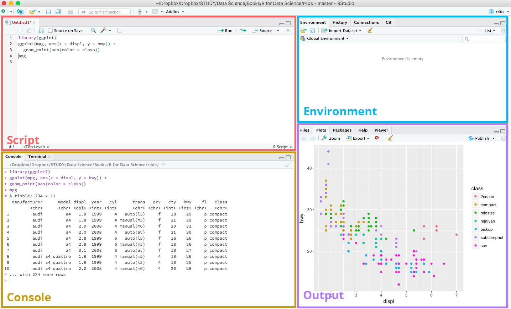

Introducción a R
========================================================
author: Iago Giné Vázquez
date: 2021-09-13
autosize: true
width: 2560
height: 1440
css: RCP.css


The R Project for Statistical Computing
========================================================


<!--  -->

- https://www.r-project.org
- Software estadístico libre, abierto y gratuito
- Miles de librerías y proyectos complementan el software base en distintas plataformas:
  + https://cran.r-project.org/
  + https://r-forge.r-project.org/
  + https://www.bioconductor.org/
- Una gran comunidad de usuarios escribe en blogs y foros:
  + https://www.r-bloggers.com/
  + https://rweekly.org/
  + https://stackoverflow.com/questions/tagged/r
- Por qué R?
  + Porque podéis escribir las instrucciones en R scripts, y ejecutarlas todas de una vez, sin tener que memorizar y repetir cada uno de los pasos.
  + Porque en Internet podréis encontrar solución a (casi) todos los problemas que os encontréis
  + Porque podréis personalizar/modificar cada instrucción con las opciones deseadas.
  + Porque podéis trabajar con más de una base de datos abierta simultáneamente y no tienen que estar guardadas en un formato específico para poder abrirlas.


R como calculadora
========================================================
- R es esencialmente una consola en la que el cursor se sitúa tras el símbolo `>`. Ahí se escriben las instrucciones. Se ejecutan con `Enter`.
- Para empezar, R permite realizar las operaciones de cualquier calculadora científico.
- Incluye además instrucciones específicas para operaciones estadísticas.


Necesitamos un editor
========================================================
- Más práctico: ejecutar múltiples operaciones simultáneamente.
- Para ello: se escriben todas en un fichero de texto simple, pero con extensión `.r` en lugar de `.txt`.
- Es suficiente un editor de texto simple. En Windows: **Bloc de notas** (en OS X: **TextEdit**).
- Otros editores facilitan la introducción y ejecución de las instrucciones.
- Ej.: **Notepad++**, **Sublime Text**, **Visual Studio Code**, **Geany**, **Nano**, **Emacs**, **VIM**, ...
- Enfocado al uso de **R** y el más usado para ello: **RStudio** (nombre del editor y de la empresa que lo produce y comercializa).
  + RStudio no es software libre, aunque su edición básica es de código abierto y gratuita.
  + https://www.rstudio.com/
  


Algunas nociones sobre RStudio
========================================================
- Las instrucciones en el R-script en RStudio se ejecutan con `Control+Enter`


Qué nos encontraremos en R?
========================================================
- Objetos elementales de las siquientes clases:
    + Lógicos (`TRUE` y `FALSE`)
    + Numéricos
    + Cadenas de caracteres
- Se pueden crear objetos más complejos añadiéndoles atributos, como pueden ser las dimensiones o las etiquetas, o modificando su estructura.
- A partir de los anteriores se pueden crear objetos compuestos con diferentes estructuras, como pueden ser: 
    + Vectores
      * Todos los elementos del vector han de ser de la misma clase.
      * Se crean y se unen con la función `c(...)`
      * Se usa `vector[i]` para acceder al i-ésimo elemento del vector
      * Una matriz es un vector con 2 dimensiones
    + Factores (para las variables categóricas; pueden ser o no ordenados)
    + Listas (colección ordenada de objetos no necesariamente del mismo tipo)
    + Data frames (para las bases de datos)
- R es un lenguaje orientado a objetos. Para asignar nombre a los objetos usamos el símbolo `<-`
- Funciones: evalúan objetos. La evaluación de un objeto `x` con una función `f` se codifica `f(x)`. Por ejemplo, para conocer la clase, estructura y atributos de un objeto `x` escribiríamos `class(x)`, `str(x)` y `attributes(x)` respectivamente.
- R dispone de una ayuda muy completa sobre todas las funciones, procedimientos y elementos que configuran el lenguaje
- Se puede acceder a ella con la función `help()` o mediante `?`. Por ejemplo, `help(class)` o `?attributes`.
- Se pueden escribir comentarios (secciones de código que el programa no ejecuta), situando antes un símbolo `#`
- Los missings en R se representan con el símbolo `NA` (cualquier clase de objetos) o también  `NaN` (objetos numéricos).


Empecemos
========================================================

```r
install.packages("tidyverse") # instala la librería tidyverse, que a su vez instala las librerías dplyr, tidyr, haven, y otras
#getwd() # Cuál es el directorio de trabajo actual?
setwd("~/Documents/PSSJD/Curso-R/") # En qué directorio de trabajo nos situamos ahora
```

O bien, mediante RStudio:
+ Panel `Packages > Install`
+ `Session > Set Working Directory > Choose Directory`
+ `Session > Set Working Directory > To Source File Location`

Cómo abriríamos la base de datos en Stata? El comando `use` la copia a la memoria

```stata
. use “data_curs_stat\Estudi_pob_w1.dta”, clear
```
Y en R? Usaremos la librería `haven`.

```r
library(haven)
#help(package = "haven") # Informémonos acerca de la librería haven
#?read_dta # ayuda de la función read_dta
read_dta("data_curs_stat/Estudi_pob_w1.dta")
```

```
# A tibble: 4,753 x 14
   q0002_hhid number_id ID_ECS       sex       age      mar1    edu1 phys_hea1  hea1   dep1 score_lon1 score_sup1 income1 income_inf1
        <dbl> <chr>      <dbl> <dbl+lbl> <dbl+lbl> <dbl+lbl> <dbl+l> <dbl+lbl> <dbl> <dbl+>      <dbl>      <dbl>   <dbl>   <dbl+lbl>
 1          1 724000001      1  2 [fem]  2 [35-49]   1 [Yes] 4 [Ter~ 1 [None]   70.5 0 [No]          3         12      15  2 [Normal]
 2          2 724000002      2  1 [masc] 2 [35-49]   1 [Yes] 4 [Ter~ 1 [None]   78.9 0 [No]          3         12      17  2 [Normal]
 3          3 724000003      3  1 [masc] 4 [65-79]   1 [Yes] 2 [Pri~ 1 [None]   66.6 0 [No]          3         12      15  2 [Normal]
 4          4 724000004      4  1 [masc] 3 [50-64]   1 [Yes] 2 [Pri~ 2 [1 phy~  77.4 0 [No]          3         11      18  2 [Normal]
 5          5 724000005      5  2 [fem]  3 [50-64]   0 [No]  4 [Ter~ 1 [None]   52.5 0 [No]          3         12      29  2 [Normal]
 6          6 724000006      6  2 [fem]  3 [50-64]   0 [No]  4 [Ter~ 1 [None]   53.7 0 [No]          3         13      25  2 [Normal]
 7          7 724000007      7  1 [masc] 3 [50-64]   1 [Yes] 3 [Sec~ 1 [None]   59.1 0 [No]          6         10      12  3 [Good]  
 8          8 724000008      8  1 [masc] 3 [50-64]   1 [Yes] 2 [Pri~ 1 [None]   76.4 0 [No]          3         12      14  2 [Normal]
 9          9 724000009      9  2 [fem]  3 [50-64]   0 [No]  3 [Sec~ 1 [None]   73.7 0 [No]          3         11      26  3 [Good]  
10         10 724000010     10  2 [fem]  5 [80+]     0 [No]  2 [Pri~ 3 [2+ ph~  28.0 0 [No]          6         13      10  2 [Normal]
# ... with 4,743 more rows
```

Primeros pasos con una base de datos (I)
========================================================
La función `read_dta` abre la base de datos, pero a diferencia de la instrucción `use` en Stata, no la copia a memoria. Así, si en Stata el podríamos ejecutar `describe` o `summarize`, si en R ejecutamos una función como `summary` el resultado es la propia función.

```r
summary
```

```
function (object, ...) 
UseMethod("summary")
<bytecode: 0x0000000025bb93e0>
<environment: namespace:base>
```

Tenemos que evaluar la función `summary` en la base de datos que abrimos con `read_dta`:

```r
summary(read_dta("data_curs_stat/Estudi_pob_w1.dta"))
```

```
   q0002_hhid     number_id             ID_ECS           sex             age             mar1             edu1         phys_hea1          hea1            dep1       
 Min.   :    1   Length:4753        Min.   :    1   Min.   :1.000   Min.   :1.000   Min.   :0.0000   Min.   :1.000   Min.   :1.000   Min.   : 0.00   Min.   :0.0000  
 1st Qu.: 1327   Class :character   1st Qu.: 1327   1st Qu.:1.000   1st Qu.:3.000   1st Qu.:0.0000   1st Qu.:1.000   1st Qu.:1.000   1st Qu.:42.83   1st Qu.:0.0000  
 Median : 2615   Mode  :character   Median : 2615   Median :2.000   Median :3.000   Median :1.0000   Median :2.000   Median :2.000   Median :55.64   Median :0.0000  
 Mean   : 3145                      Mean   : 3145   Mean   :1.547   Mean   :3.235   Mean   :0.5986   Mean   :2.258   Mean   :1.798   Mean   :53.97   Mean   :0.1113  
 3rd Qu.: 3807                      3rd Qu.: 3807   3rd Qu.:2.000   3rd Qu.:4.000   3rd Qu.:1.0000   3rd Qu.:3.000   3rd Qu.:2.000   3rd Qu.:66.06   3rd Qu.:0.0000  
 Max.   :92755                      Max.   :92755   Max.   :2.000   Max.   :5.000   Max.   :1.0000   Max.   :4.000   Max.   :3.000   Max.   :92.82   Max.   :1.0000  
                                                                                                     NA's   :5       NA's   :605     NA's   :187     NA's   :170     
   score_lon1     score_sup1       income1        income_inf1   
 Min.   :3.00   Min.   : 3.00   Min.   : 1.000   Min.   :1.000  
 1st Qu.:3.00   1st Qu.:10.00   1st Qu.: 2.000   1st Qu.:1.000  
 Median :3.00   Median :12.00   Median : 5.000   Median :2.000  
 Mean   :3.74   Mean   :11.53   Mean   : 8.989   Mean   :1.991  
 3rd Qu.:4.00   3rd Qu.:13.00   3rd Qu.:15.000   3rd Qu.:3.000  
 Max.   :9.00   Max.   :14.00   Max.   :35.000   Max.   :3.000  
 NA's   :285    NA's   :414     NA's   :1067     NA's   :185    
```

Primeros pasos con una base de datos (II)
========================================================
No es práctico. Asignamos la base de datos a una variable que llamamos `dataw1`:

```r
dataw1 <- read_dta("data_curs_stat/Estudi_pob_w1.dta")
#summary(dataw1)
#str(dataw1)
class(dataw1)
```

```
[1] "tbl_df"     "tbl"        "data.frame"
```

```r
head(dataw1) # primeras (6) filas
```

```
# A tibble: 6 x 14
  q0002_hhid number_id ID_ECS       sex       age      mar1    edu1 phys_hea1  hea1   dep1 score_lon1 score_sup1 income1 income_inf1
       <dbl> <chr>      <dbl> <dbl+lbl> <dbl+lbl> <dbl+lbl> <dbl+l> <dbl+lbl> <dbl> <dbl+>      <dbl>      <dbl>   <dbl>   <dbl+lbl>
1          1 724000001      1  2 [fem]  2 [35-49]   1 [Yes] 4 [Ter~ 1 [None]   70.5 0 [No]          3         12      15  2 [Normal]
2          2 724000002      2  1 [masc] 2 [35-49]   1 [Yes] 4 [Ter~ 1 [None]   78.9 0 [No]          3         12      17  2 [Normal]
3          3 724000003      3  1 [masc] 4 [65-79]   1 [Yes] 2 [Pri~ 1 [None]   66.6 0 [No]          3         12      15  2 [Normal]
4          4 724000004      4  1 [masc] 3 [50-64]   1 [Yes] 2 [Pri~ 2 [1 phy~  77.4 0 [No]          3         11      18  2 [Normal]
5          5 724000005      5  2 [fem]  3 [50-64]   0 [No]  4 [Ter~ 1 [None]   52.5 0 [No]          3         12      29  2 [Normal]
6          6 724000006      6  2 [fem]  3 [50-64]   0 [No]  4 [Ter~ 1 [None]   53.7 0 [No]          3         13      25  2 [Normal]
```

```r
#head(dataw1, 3) # primeras 3 filas
#tail(dataw1) # últimas (6) filas
```

**Ejercicio 1**: 

*Usando las funciones `setwd` y `read_dta` convenientemente (hay varias posibilidades), guardar también las bases de datos `Estudi_pob_w2.dta` y `Estudi_pob_w3.dta` en dos variables que llamaremos `dataw2` y `dataw3`.*

Acceso a las variables de una base de datos: `$` y `[[`
========================================================

```r
# dataw1$phys_hea1
# dataw1[["phys_hea1"]]
class(dataw1$phys_hea1) # double quiere decir que está guardada como una variable numérica
```

```
[1] "haven_labelled" "vctrs_vctr"     "double"        
```

```r
#summary(dataw1$phys_hea1)
str(dataw1$phys_hea1)
```

```
 dbl+lbl [1:4753]  1,  1,  1,  2,  1,  1,  1,  1,  1,  3,  1,  1,  3,  1, NA, NA,  3,  1,  2,  2,  1,  2,  2,  1,  1, NA,  2,  1,  1,  1,  1,  3,  1,  1,  1,  3,  1,  1,  1,  ...
 @ label       : chr "Number of physical health problems W1"
 @ format.stata: chr "%27.0g"
 @ labels      : Named num [1:3] 1 2 3
  ..- attr(*, "names")= chr [1:3] "None" "1 physical health problem" "2+ physical health problems"
```

```r
#attributes(dataw1$phys_hea1)
table(dataw1$phys_hea1)
```

```

   1    2    3 
1723 1538  887 
```

```r
#?table
table(dataw1$phys_hea1, useNA = "ifany")
```

```

   1    2    3 <NA> 
1723 1538  887  605 
```

```r
prop.table(table(dataw1$phys_hea1))
```

```

        1         2         3 
0.4153809 0.3707811 0.2138380 
```

Transformación de variables (I)
========================================================
- La función `as.factor` permite transformar a una variable categórica

```r
class(as.factor(dataw1$phys_hea1))
```

```
[1] "factor"
```

```r
table(as.factor(dataw1$phys_hea1), useNA = "ifany")
```

```

   1    2    3 <NA> 
1723 1538  887  605 
```

- La función `as_factor` de la librería `haven` permite transformar a una variable categórica con las etiquetas como categorías

```r
class(as_factor(dataw1$phys_hea1))
```

```
[1] "factor"
```

```r
table(as_factor(dataw1$phys_hea1), useNA = "ifany")
```

```

                       None   1 physical health problem 2+ physical health problems                        <NA> 
                       1723                        1538                         887                         605 
```

Guardamos la transformación en la base de datos. Para ello usaremos la función `mutate` de la librería `dplyr`, que permite realizar varias transformaciones separadas por comas

```r
library(dplyr)
#?mutate

dataw1 <- dataw1 %>% #partimos de la base de datos dataw1 y entonces
  mutate(phys_hea1 = as_factor(phys_hea1)) # transformamos la variable y la guardamos con el mismo nombre

# finalmente la base de datos queda guardada con el mismo nombre mediante la asignación inicial (dataw1 <- ...)
```

Transformación de variables (II)
========================================================
La variable `number_id` está guardada como cadena, pero, siendo un número, quizás preferimos guardarla como numérica, igual que q0002_hhid. Para ello podemos usar la función `as.numeric`.

```r
#class(dataw1$q0002_hhid)
#class(dataw1$number_id)
#?as.numeric
```


Varias transformaciones seguidas las podemos evaluar:
- Aplicando varias veces `mutate`:

```r
dataw1 <- dataw1 %>% #partimos de la base de datos dataw1 y entonces
  mutate(phys_hea1 = as_factor(phys_hea1))  %>% # transformamos la variable phys_hea1 y la guardamos con el mismo nombre, y entonces
  mutate(dep1 = as_factor(dep1)) %>% # transformamos la variable dep1 y la guardamos con el mismo nombre
  mutate(q0002_hhid = as.numeric(q0002_hhid)) # transformamos la variable q0002_hhid y la guardamos con el mismo nombre
```

- Pero en lugar de eso, habitualmente se separan las instrucciones por comas en un sólo `mutate`:

```r
dataw1 <- dataw1 %>% #partimos de la base de datos dataw1 y entonces
  mutate(phys_hea1 = as_factor(phys_hea1), dep1 = as_factor(dep1), q0002_hhid = as.numeric(q0002_hhid)) # transformamos las variables phys_hea1,  dep1 y q0002_hhid y las guardamos con los mismos nombres
```
- O bien, cuando estamos aplicando la misma transformación (en este caso `as_factor`) a varias variables (y guardándolas con el mismo nombre), podemos usar `across(vector de variables, función)` dentro de `mutate`:

```r
dataw1 <- dataw1 %>% #partimos de la base de datos dataw1 y entonces
  mutate(across(c(phys_hea1, dep1), as_factor), q0002_hhid = as.numeric(q0002_hhid)) # evaluamos as_factor a través de las variables phys_hea1 y dep1 y transformamos también q0002_hhid
```


**Ejercicio 2**: 

*Buscar todas las variables categóricas en las 3 bases de datos y transformar estas bases de datos de manera que esas variables sean factores. Mostrar las frecuencias de las categorías de algunas de esas variables. Transformar la variable `q0002_hhid` o `number_id` o ambas de manera que ambas tengan la misma clase (para ello pueden usarse funciones como `as.character`, `as.numeric`, `as.integer` o `as.factor`; véase la ayuda para cada una de ellas).*


Otras operaciones con funciones de la librería `dplyr`
========================================================
- Ejemplo 1


```r
dataw1 %>% #partimos de la base de datos dataw1 y entonces
  select(number_id, hea1, dep1) %>% # mantenemos sólo las columnas number_id, hea1 y dep1, y entonces
  mutate(dep1 = as_factor(dep1)) %>% # transformamos la variable  dep1 y la guardamos con el mismo nombre, y entonces
  filter(dep1 == "Yes") %>% # nos quedamos con las filas de quienes padecen depresión, y entonces
  arrange(desc(hea1)) %>% # ordenamos las filas por de mayor a menor valor de estado de salud, y entonces
  head(3) # nos quedamos con los 3 pacientes con depresión con mayor valor de Health state
```

```
# A tibble: 3 x 3
  number_id  hea1 dep1 
  <chr>     <dbl> <fct>
1 724004941  82.1 Yes  
2 724004339  80.2 Yes  
3 724001299  79.8 Yes  
```

- Ejemplo 2


```r
dataw1 %>% #partimos de la base de datos dataw1 y entonces
  select(number_id, hea1, dep1) %>% # mantenemos sólo las columnas number_id, hea1 y dep1, y entonces
  mutate(dep1 = as_factor(dep1)) %>% # transformamos la variable  dep1 y la guardamos con el mismo nombre, y entonces
  group_by(dep1) %>% # agrupamos por las categorías de depresión, y entonces
  summarise(mean_hea1 = mean(hea1, na.rm = TRUE), n = n()) # calculamos la media de hea1 para cada categoría de depresión y el número de observaciones por cada categoría
```

```
# A tibble: 3 x 3
  dep1  mean_hea1     n
  <fct>     <dbl> <int>
1 No         55.9  4073
2 Yes        38.4   510
3 <NA>      NaN     170
```

Nota: usamos `na.rm = TRUE` dentro de `mean` para que calcule la media de aquellos valores que no son missing. En caso contrario, cuando hay missings el resultado es `NA`.
Nota: Todo lo anterior se puede realizar también con funciones de R sin necesidad de acudir a la librería `dplyr`, pero no tenemos posibilidades como el uso de `across`, o las alternativas pueden ser más complejas.


Variables y dimensiones de las bbdd
========================================================

```r
names(dataw1)
```

```
 [1] "q0002_hhid"  "number_id"   "ID_ECS"      "sex"         "age"         "mar1"        "edu1"        "phys_hea1"   "hea1"        "dep1"        "score_lon1"  "score_sup1" 
[13] "income1"     "income_inf1"
```

```r
dim(dataw1)
```

```
[1] 4753   14
```

```r
names(dataw2)
```

```
[1] "number_id"  "q0002_hhid" "dep2"       "score_lon2" "score_sup2" "income2"    "phys_hea2"  "hea2"      
```

```r
dim(dataw2)
```

```
[1] 4702    8
```

```r
names(dataw3)
```

```
 [1] "number_id"     "q0002_hhid"    "dep3"          "score_lon3"    "score_sup3"    "income3"       "arthritis3"    "angina3"       "asthma3"       "diabetes3"     "hypertension3"
```

```r
dim(dataw3)
```

```
[1] 4590   11
```

Fusión (merge) de bbdd (I)
========================================================

Características (clase y missings) de la variable `q0002_hhid`:


```r
#?is.na
class(dataw1$q0002_hhid); class(dataw2$q0002_hhid); #class(dataw3$q0002_hhid)
```

```
[1] "numeric"
```

```
[1] "numeric"
```

```r
#table(is.na(dataw1$q0002_hhid)); table(is.na(dataw2$q0002_hhid)); table(is.na(dataw3$q0002_hhid))# contamos el número de missings de q0002_hhid
```


```r
data <- dataw1 %>% # partimos de la base de datos dataw1 y entonces
  full_join(dataw2, by = c("q0002_hhid")) %>% # unimos horizontalmente con todas las observaciones de dataw2 con q0002_hhid iguales a los de dataw1 y añadimos las nuevas, y entonces
  full_join(dataw3, by = c("q0002_hhid"))# unimos horizontalmente con todas las observaciones de dataw3 con q0002_hhid iguales a los que ya había y añadimos las nuevas
names(data)
```

```
 [1] "q0002_hhid"    "number_id.x"   "ID_ECS"        "sex"           "age"           "mar1"          "edu1"          "phys_hea1"     "hea1"          "dep1"          "score_lon1"   
[12] "score_sup1"    "income1"       "income_inf1"   "number_id.y"   "dep2"          "score_lon2"    "score_sup2"    "income2"       "phys_hea2"     "hea2"          "number_id"    
[23] "dep3"          "score_lon3"    "score_sup3"    "income3"       "arthritis3"    "angina3"       "asthma3"       "diabetes3"     "hypertension3"
```

```r
dim(data)
```

```
[1] 4753   31
```


```r
?full_join
```

**Ejercicio 3**:

Con `full_join` creamos una base de datos resultado de fusionar las 3 iniciales e incluír todas las observaciones de cada una de ellas. Mirando en la ayuda, este ejercicio consiste en fusionar las 3 bases de datos, pero incluyendo sólo aquellas observaciones de id's comunes a las 3. Cuántas observaciones tiene?


Assaig clinic
========================================================

```r
ac1 <- read_dta("data_curs_stat/Assaig_clinic_w1.dta")
ac2 <- read_dta("data_curs_stat/Assaig_clinic_w2.dta")
ac3 <- read_dta("data_curs_stat/Assaig_clinic_w3.dta")

ach <- ac1 %>% 
  inner_join(ac2, by = c("number_id","q0002_hhid")) %>% 
  inner_join(ac3, by = c("number_id", "q0002_hhid")) %>% dim()
```


Slide With Plot
========================================================


